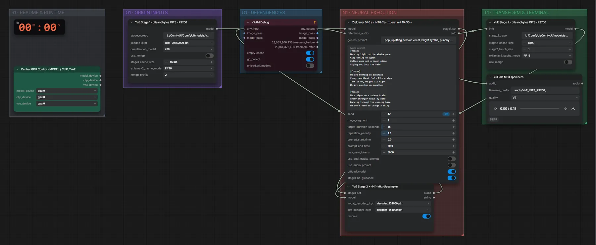

# YuE 7B (INT8) · Genre-Tags + Songtext → Song

**Workflow-Datei:** [`workflows/Music Generation/YuE_7B_INT8-Tags+Lyrics-to-Song.json`](../../../workflows/Music%20Generation/YuE_7B_INT8-Tags%2BLyrics-to-Song.json)  
**Kategorie:** Music Generation · **Eingabe → Ausgabe:** Tags + Songtext → Song · **Quant:** INT8

Bis v1.3.0 hieß der Workflow `YuE_7B-INT8_R9700-Music-Generation.json`.

INT8-Variante von YuE (bitsandbytes) für Karten mit wenig VRAM.

Interaktiv mit Zoom, Vergleichen und Kopier-Buttons: <https://dawasteh.github.io/DaWastehs-ComfyUI-Bundle/#/w/yue-7b-int8-tags-lyrics-to-song>

> Gekürztes Beispiel (ein Abschnitt, 15 s): Auf dem Referenzrechner (Windows, ROCm) rechnet bitsandbytes-INT8 sehr langsam – 36 Minuten für 15 Sekunden; Stufe 2 eines 60-Sekunden-Songs war nach zwei Stunden nicht fertig. Die FP16-Variante braucht auf der R9700 für 60 Sekunden rund 25 Minuten.

## Modelle

| Rolle | Datei | Quant | Größe |
|---|---|---|---:|
| Modell | `ckpt_00360000.pth` | – | 1,3 GiB |
| Modell | `decoder_131000.pth` | – | 0,1 GiB |
| Modell | `decoder_151000.pth` | – | 0,1 GiB |

## Workflow in ComfyUI

Screenshot nach dem Hauptbeispiel (Eingaben und Ergebnis im Workflow, Erklärungstafeln ausgeblendet):

[](workflow.webp)

## Beispiele

### Genre-Tags + Songtext → Song

Prompt:

```text
pop, uplifting, female vocal, bright synths, punchy drums, summer
```

| Einstellung | Wert |
|---|---|
| lyrics | [Verse]
Morning light on the window pane
City waking up again
Coffee cups and a paper plane
Flying out into the rain

[Chorus]
We are running on sunshine
Every heartbeat feels like a sign
Turn it up, we got all night
We are running on sunshine

[Verse]
Neon signs on a subway train
Every stranger knows my name
Dancing through the evening haze
We don't need to change a thing

[Chorus]
We are running on sunshine
Every heartbeat feels like a sign
Turn it up, we got all night
We are running on sunshine |
| duration | 1 Abschnitt(e) (~15 s) |
| seed | 42 |
| Dauer (Ausführung) | 35 min 48 s |
| VRAM R9700 (belegt / PyTorch-Spitze) | 16,9 GiB / 10,2 GiB |
| RAM (ComfyUI-Prozess) | 33,7 GiB |

1 Liedabschnitt(e), ~15 s statt der voreingestellten 540-s-Zieldauer. INT8 rechnet unter ROCm sehr langsam, daher nur ein kurzer Abschnitt.

Ausgabe · YuE als MP3 speichern: [pop.mp3](pop.mp3)
