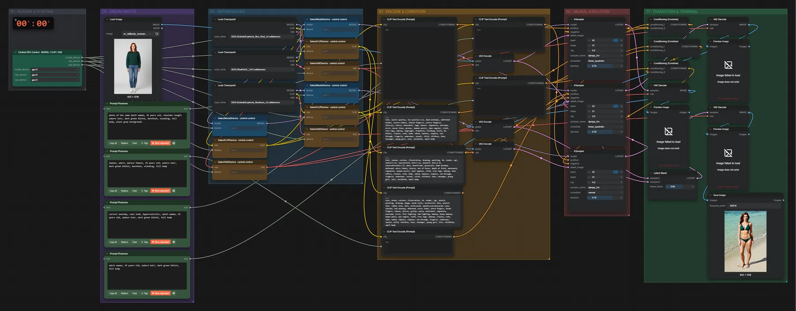

# SDXL Illustrious + RealVisXL · Bild → drei Checkpoints

**Workflow-Datei:** [`workflows/NSFW/SDXL_Illustrious+RealVisXL_FP16-Image+Text-to-Image-Multi-Checkpoint.json`](../../../workflows/NSFW/SDXL_Illustrious%2BRealVisXL_FP16-Image%2BText-to-Image-Multi-Checkpoint.json)  
**Kategorie:** NSFW · **Eingabe → Ausgabe:** Bild + Text → Bild · **Quant:** FP16

Bis v1.3.0 hieß der Workflow `SDXL_Multi-Checkpoint_v1-Text-to-Image.json`.

Ein Eingabebild läuft nacheinander durch drei Checkpoints (je Denoise 0,7).

Interaktiv mit Zoom, Vergleichen und Kopier-Buttons: <https://dawasteh.github.io/DaWastehs-ComfyUI-Bundle/#/w/sdxl-illustrious-realvisxl-fp16-image-text-to-image-multi-checkpoint>

## Modelle

| Rolle | Datei | Quant | Größe |
|---|---|---|---:|
| Modell | `EclecticEuphoria_Illus_Real_v3.safetensors` | FP16 | 6,5 GiB |
| Modell | `RealVisXL_V4.0.safetensors` | FP16 | 6,5 GiB |
| Modell | `EclecticEuphoria_Illustrious_v2.safetensors` | FP16 | 6,5 GiB |

## Workflow in ComfyUI

Screenshot nach dem Hauptbeispiel (Eingaben und Ergebnis im Workflow, Erklärungstafeln ausgeblendet):

[](workflow.webp)

## Beispiele

### Bekleidete Person → Bademode (drei Checkpoints)

Prompt:

```text
photo of the same adult woman, 35 years old, shoulder-length auburn hair, dark green bikini, barefoot, standing, full body, plain grey background
```

| Einstellung | Wert |
|---|---|
| seed | 42 |
| steps | 21 |
| sampler_name | dpmpp_2m |
| denoise | 0.7 |
| Dauer (Ausführung) | 40 s |
| VRAM R9700 (belegt / PyTorch-Spitze) | 28,9 GiB / 20,3 GiB |
| RAM (ComfyUI-Prozess) | 17,5 GiB |

Entschärftes Beispiel: generierte, eindeutig erwachsene Person, Bademode statt Nacktheit; der Workflow selbst ist für die NSFW-Kategorie gedacht.

Eingabe · ex_fullbody_woman.png:  ([Datei](input_ex_fullbody_woman.webp))  
Ausgabe · Ausgabe: [](bikini.webp) · [Volle Auflösung (832×1216, WebP mit Workflow – per Drag & Drop in ComfyUI ladbar)](bikini.webp)
