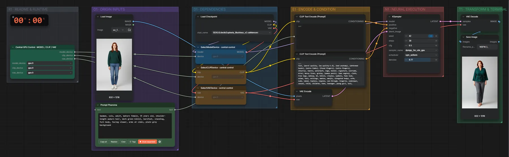

# SDXL Illustrious v2 · Bild + Tags → Bild

**Workflow-Datei:** [`workflows/NSFW/SDXL_Illustrious_V2_FP16-Image+Text-to-Image.json`](../../../workflows/NSFW/SDXL_Illustrious_V2_FP16-Image%2BText-to-Image.json)  
**Kategorie:** NSFW · **Eingabe → Ausgabe:** Bild + Text → Bild · **Quant:** FP16

Bis v1.3.0 hieß der Workflow `SDXL_Illustrious_v2-Text-to-Image.json`.

Nimmt ein Eingabebild als Ausgangspunkt (Denoise 0,77) – der alte Name sagte Text-to-Image.

Interaktiv mit Zoom, Vergleichen und Kopier-Buttons: <https://dawasteh.github.io/DaWastehs-ComfyUI-Bundle/#/w/sdxl-illustrious-v2-fp16-image-text-to-image>

## Modelle

| Rolle | Datei | Quant | Größe |
|---|---|---|---:|
| Modell | `EclecticEuphoria_Illustrious_v2.safetensors` | FP16 | 6,5 GiB |

## Workflow in ComfyUI

Screenshot nach dem Hauptbeispiel (Eingaben und Ergebnis im Workflow, Erklärungstafeln ausgeblendet):

[](workflow.webp)

## Beispiele

### Bekleidete Person → Bademode

Prompt:

```text
1woman, solo, adult, mature female, 35 years old, shoulder-length auburn hair, dark green bikini, barefoot, standing, full body, facing viewer, arms at sides, plain grey background
```

| Einstellung | Wert |
|---|---|
| seed | 42 |
| steps | 30 |
| cfg | 6.5 |
| sampler_name | dpmpp_3m_sde_gpu |
| scheduler | sgm_uniform |
| denoise | 0.77 |
| Dauer (Ausführung) | 15 s |
| VRAM R9700 (belegt / PyTorch-Spitze) | 17,1 GiB / 12,2 GiB |
| RAM (ComfyUI-Prozess) | 12,4 GiB |

Entschärftes Beispiel: generierte, eindeutig erwachsene Person, Bademode statt Nacktheit; der Workflow selbst ist für die NSFW-Kategorie gedacht.

Eingabe · ex_fullbody_woman.png:  ([Datei](input_ex_fullbody_woman.webp))  
Ausgabe · Ausgabe: [](bikini.webp) · [Volle Auflösung (832×1216, WebP mit Workflow – per Drag & Drop in ComfyUI ladbar)](bikini.webp)
