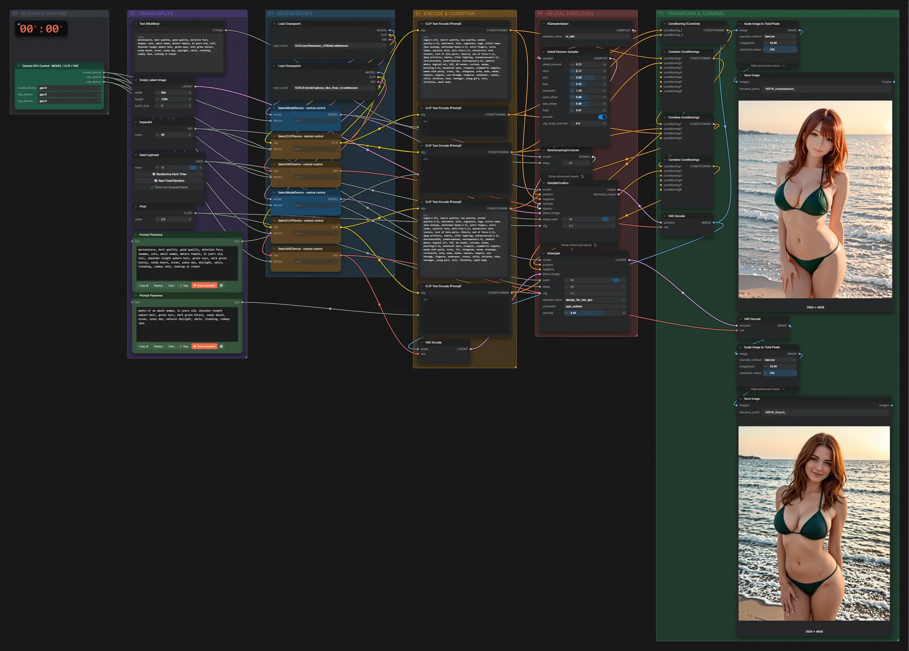

# SDXL One Obsession + Illus Real · Text → Anime → realistisch

**Workflow-Datei:** [`workflows/NSFW/SDXL_OneObsession+IllusReal_FP16-Text-to-Anime-to-Real-Image.json`](../../../workflows/NSFW/SDXL_OneObsession%2BIllusReal_FP16-Text-to-Anime-to-Real-Image.json)  
**Kategorie:** NSFW · **Eingabe → Ausgabe:** Text → Bild · **Quant:** FP16

Bis v1.3.0 hieß der Workflow `SDXL_AniToReal_v1-Image-to-Image.json`.

Erzeugt erst ein Anime-Bild und verwandelt es in einem zweiten Durchgang in eine realistische Version (der alte Name sagte Image-to-Image, der Workflow startet aus Text).

Interaktiv mit Zoom, Vergleichen und Kopier-Buttons: <https://dawasteh.github.io/DaWastehs-ComfyUI-Bundle/#/w/sdxl-oneobsession-illusreal-fp16-text-to-anime-to-real-image>

## Modelle

| Rolle | Datei | Quant | Größe |
|---|---|---|---:|
| Modell | `oneObsession_v20Bold.safetensors` | FP16 | 6,5 GiB |
| Modell | `EclecticEuphoria_Illus_Real_v3.safetensors` | FP16 | 6,5 GiB |

## Workflow in ComfyUI

Screenshot nach dem Hauptbeispiel (Eingaben und Ergebnis im Workflow, Erklärungstafeln ausgeblendet):

[](workflow.webp)

## Beispiele

### Anime-Bild → realistische Version

Prompt:

```text
masterpiece, best quality, good quality, detailed face, 1woman, solo, adult woman, mature female, 35 years old, tall, shoulder-length auburn hair, green eyes, dark green bikini, sandy beach, ocean, sunny day, daylight, smile, standing, cowboy shot, looking at viewer
```

| Einstellung | Wert |
|---|---|
| seed | 66 |
| steps | 50 |
| cfg | 4.2 |
| scheduler | sgm_uniform |
| denoise | 0.64 |
| Dauer (Ausführung) | 1 min 55 s |
| VRAM R9700 (belegt / PyTorch-Spitze) | 26,6 GiB / 19,4 GiB |
| RAM (ComfyUI-Prozess) | 12,6 GiB |

Entschärftes Beispiel: generierte, eindeutig erwachsene Person, Bademode statt Nacktheit; der Workflow selbst ist für die NSFW-Kategorie gedacht.

Ausgabe · Final: [](beach__n90.webp) · [Volle Auflösung (3584×4608, WebP mit Workflow – per Drag & Drop in ComfyUI ladbar)](beach__n90.webp)  
Ausgabe · Pass 1: [](beach__n42.webp)
