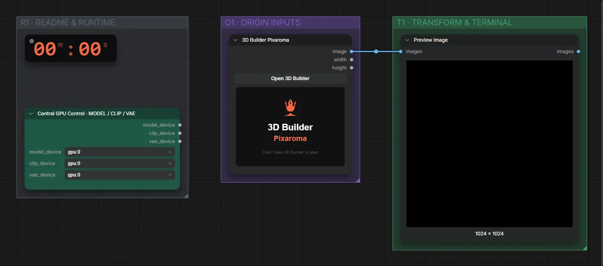

# Pixaroma · 3D-Builder

**Workflow-Datei:** [`workflows/Pixaroma Node Demos/Pixaroma-3D-Builder.json`](../../../workflows/Pixaroma%20Node%20Demos/Pixaroma-3D-Builder.json)  
**Kategorie:** Pixaroma Node Demos · **Eingabe → Ausgabe:** – → Bild

Szene aus Grundkörpern bauen und rendern.

Interaktiv mit Zoom, Vergleichen und Kopier-Buttons: <https://dawasteh.github.io/DaWastehs-ComfyUI-Bundle/#/w/pixaroma-3d-builder>

> Kein Beispiel-Lauf: Der Editor ist im Workflow leer – ohne eigene Szene liefert der Knoten nur eine leere Fläche. Den Editor des Knotens öffnen, Grundkörper einfügen und anordnen, dann ausführen.

## Workflow in ComfyUI

Screenshot nach dem Hauptbeispiel (Eingaben und Ergebnis im Workflow, Erklärungstafeln ausgeblendet):

