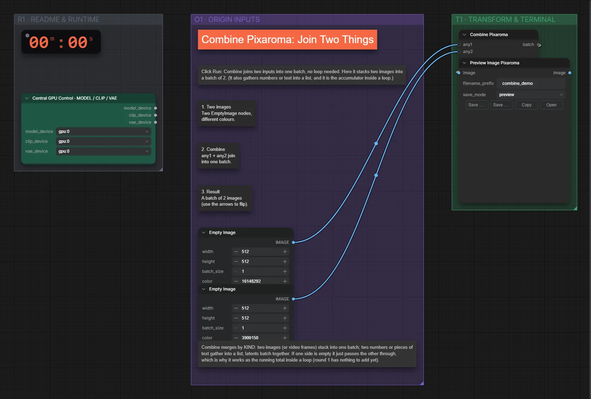

# Pixaroma · zwei Bilder kombinieren

**Workflow-Datei:** [`workflows/Pixaroma Node Demos/Pixaroma-Combine-Two-Images.json`](../../../workflows/Pixaroma%20Node%20Demos/Pixaroma-Combine-Two-Images.json)  
**Kategorie:** Pixaroma Node Demos · **Eingabe → Ausgabe:** – → Bild

Zwei Bilder nebeneinander setzen.

Interaktiv mit Zoom, Vergleichen und Kopier-Buttons: <https://dawasteh.github.io/DaWastehs-ComfyUI-Bundle/#/w/pixaroma-combine-two-images>

## Workflow in ComfyUI

Screenshot nach dem Hauptbeispiel (Eingaben und Ergebnis im Workflow, Erklärungstafeln ausgeblendet):

## Beispiele

### Mitgelieferte Demo

| Einstellung | Wert |
|---|---|
| Dauer (Ausführung) | 11 s |
| VRAM R9700 (belegt / PyTorch-Spitze) | 4,7 GiB / 0,1 GiB |
| RAM (ComfyUI-Prozess) | 0,8 GiB |

Unverändert – die Demo-Daten stecken im Workflow.

Ausgabe · Bild 1:  · [Volle Auflösung (512×512, WebP mit Workflow – per Drag & Drop in ComfyUI ladbar)](default__n23-1.webp)  
Ausgabe · Bild 2: 
