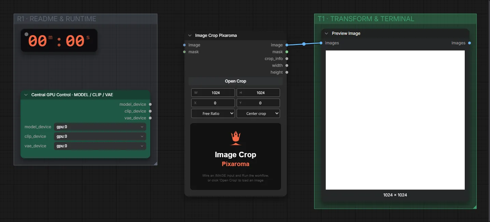

# Pixaroma · Zuschneiden

**Workflow-Datei:** [`workflows/Pixaroma Node Demos/Pixaroma-Crop.json`](../../../workflows/Pixaroma%20Node%20Demos/Pixaroma-Crop.json)  
**Kategorie:** Pixaroma Node Demos · **Eingabe → Ausgabe:** – → Bild

Bild interaktiv zuschneiden.

Interaktiv mit Zoom, Vergleichen und Kopier-Buttons: <https://dawasteh.github.io/DaWastehs-ComfyUI-Bundle/#/w/pixaroma-crop>

> Kein Beispiel-Lauf: Der Editor ist im Workflow leer – ohne eigenes Bild liefert der Knoten nur eine leere Fläche. Den Editor des Knotens öffnen, ein Bild laden und den Ausschnitt ziehen, dann ausführen.

## Workflow in ComfyUI

Screenshot nach dem Hauptbeispiel (Eingaben und Ergebnis im Workflow, Erklärungstafeln ausgeblendet):

