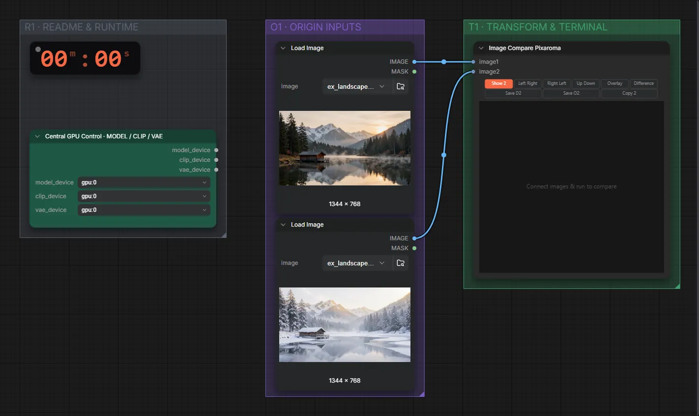

# Pixaroma · Bildvergleich

**Workflow-Datei:** [`workflows/Pixaroma Node Demos/Pixaroma-Image-Compare.json`](../../../workflows/Pixaroma%20Node%20Demos/Pixaroma-Image-Compare.json)  
**Kategorie:** Pixaroma Node Demos · **Eingabe → Ausgabe:** Bild → Vergleich

Zwei Bilder mit Regler vergleichen.

Interaktiv mit Zoom, Vergleichen und Kopier-Buttons: <https://dawasteh.github.io/DaWastehs-ComfyUI-Bundle/#/w/pixaroma-image-compare>

## Workflow in ComfyUI

Screenshot nach dem Hauptbeispiel (Eingaben und Ergebnis im Workflow, Erklärungstafeln ausgeblendet):

## Beispiele

### Zwei Bilder vergleichen

| Einstellung | Wert |
|---|---|
| Dauer (Ausführung) | 0 s |
| VRAM R9700 (belegt / PyTorch-Spitze) | 4,7 GiB / 0,1 GiB |
| RAM (ComfyUI-Prozess) | 0,9 GiB |

Eingabe · ex_landscape_lake.png:  ([Datei](input_ex_landscape_lake.webp))  
Eingabe · ex_landscape_lake_winter.png:  ([Datei](input_ex_landscape_lake_winter.webp))  
Ausgabe · Bild 1:  · [Volle Auflösung (1344×768, WebP)](winter__n1-1.webp)  
Ausgabe · Bild 2: 
