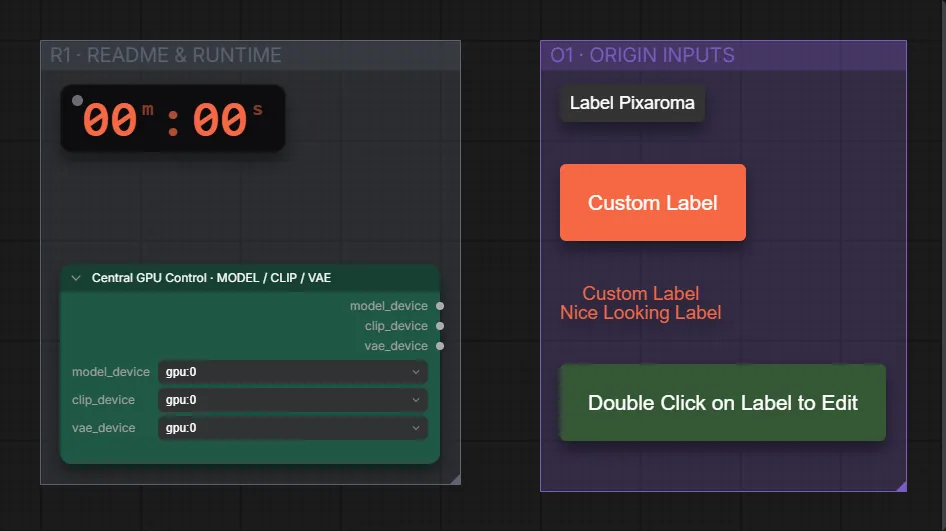

# Pixaroma · Beschriftungen

**Workflow-Datei:** [`workflows/Pixaroma Node Demos/Pixaroma-Labels.json`](../../../workflows/Pixaroma%20Node%20Demos/Pixaroma-Labels.json)  
**Kategorie:** Pixaroma Node Demos · **Eingabe → Ausgabe:** – → –

Überschriften und Labels für Workflows.

Interaktiv mit Zoom, Vergleichen und Kopier-Buttons: <https://dawasteh.github.io/DaWastehs-ComfyUI-Bundle/#/w/pixaroma-labels>

> Kein Beispiel-Lauf: Die Demo zeigt eine Canvas-Funktion ohne Ausgabe-Node, ComfyUI führt sie nicht aus.

## Workflow in ComfyUI

Screenshot nach dem Hauptbeispiel (Eingaben und Ergebnis im Workflow, Erklärungstafeln ausgeblendet):

