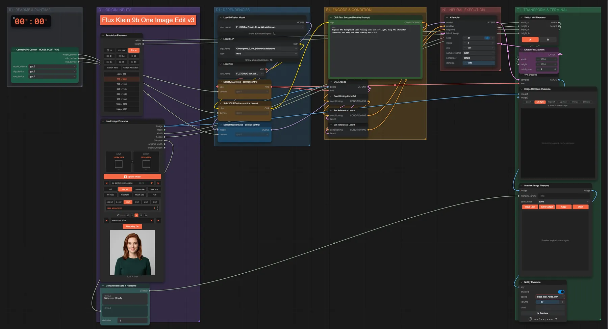

# Pixaroma · Laden, Benachrichtigen, Umschalten, Export

**Workflow-Datei:** [`workflows/Pixaroma Node Demos/Pixaroma-LoadImage-Notify-Switch-Export-v3.json`](../../../workflows/Pixaroma%20Node%20Demos/Pixaroma-LoadImage-Notify-Switch-Export-v3.json)  
**Kategorie:** Pixaroma Node Demos · **Eingabe → Ausgabe:** Bild → Bild

Pixaroma-Bildloader, FLUX.2-Klein-Edit, Benachrichtigung am Ende und Vergleich.

Interaktiv mit Zoom, Vergleichen und Kopier-Buttons: <https://dawasteh.github.io/DaWastehs-ComfyUI-Bundle/#/w/pixaroma-loadimage-notify-switch-export-v3>

## Modelle

| Rolle | Datei | Quant | Größe |
|---|---|---|---:|
| VAE | `flux2-vae.safetensors` | FP32 | 0,3 GiB |
| Text-Encoder / LLM | `qwen_3_8b_fp8mixed.safetensors` | FP8 mixed | 8,1 GiB |
| Diffusionsmodell | `flux-2-klein-9b-kv-fp8.safetensors` | FP8 | 9,1 GiB |

## Workflow in ComfyUI

Screenshot nach dem Hauptbeispiel (Eingaben und Ergebnis im Workflow, Erklärungstafeln ausgeblendet):

## Beispiele

### Laden, bearbeiten, benachrichtigen

| Einstellung | Wert |
|---|---|
| seed | 42 |
| steps | 4 |
| cfg | 1 |
| sampler_name | euler |
| scheduler | simple |
| denoise | 1 |
| Dauer (Ausführung) | 34 s |
| VRAM R9700 (belegt / PyTorch-Spitze) | 23,4 GiB / 19,7 GiB |
| RAM (ComfyUI-Prozess) | 10,4 GiB |

Eingabe · ex_portrait_woman.png:  ([Datei](input_ex_portrait_woman.webp))  
Ausgabe · Ausgabe:  · [Volle Auflösung (1024×1024, WebP mit Workflow – per Drag & Drop in ComfyUI ladbar)](snow.webp)
