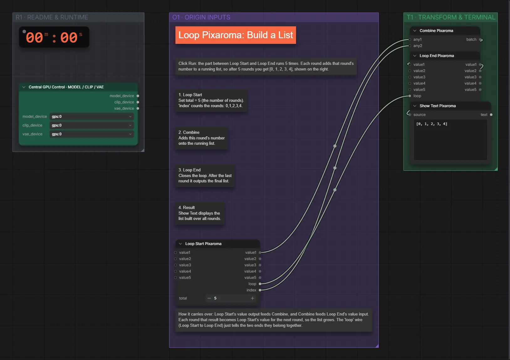

# Pixaroma · Schleife: Liste bauen

**Workflow-Datei:** [`workflows/Pixaroma Node Demos/Pixaroma-Loop-Build-List.json`](../../../workflows/Pixaroma%20Node%20Demos/Pixaroma-Loop-Build-List.json)  
**Kategorie:** Pixaroma Node Demos · **Eingabe → Ausgabe:** – → Text

Pixaroma-Loop sammelt Texte zu einer Liste.

Interaktiv mit Zoom, Vergleichen und Kopier-Buttons: <https://dawasteh.github.io/DaWastehs-ComfyUI-Bundle/#/w/pixaroma-loop-build-list>

## Workflow in ComfyUI

Screenshot nach dem Hauptbeispiel (Eingaben und Ergebnis im Workflow, Erklärungstafeln ausgeblendet):

[](workflow.webp)

## Beispiele

### Mitgelieferte Demo

| Einstellung | Wert |
|---|---|
| Dauer (Ausführung) | 10 s |
| VRAM R9700 (belegt / PyTorch-Spitze) | 5,1 GiB / 0,1 GiB |
| RAM (ComfyUI-Prozess) | 1,4 GiB |

Unverändert – die Demo-Daten stecken im Workflow.


PixaromaShowText:

```text
[0, 1, 2, 3, 4]
```
