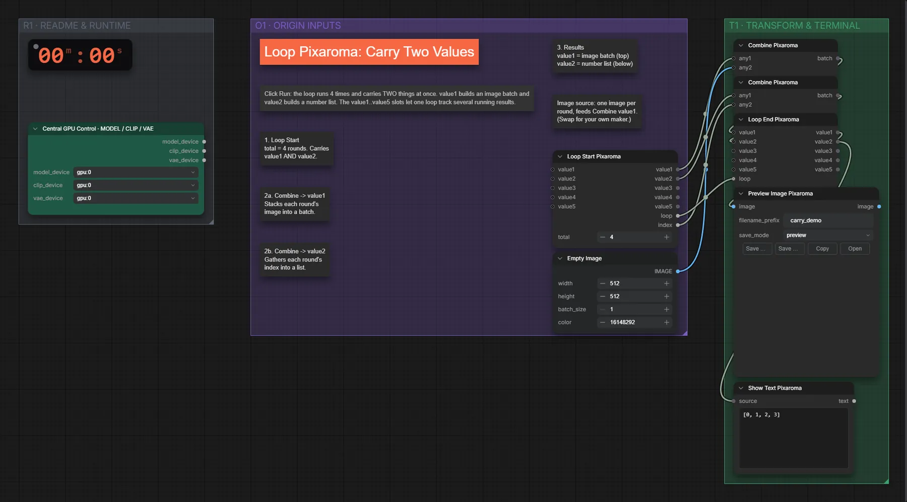

# Pixaroma · Schleife: zwei Werte weiterreichen

**Workflow-Datei:** [`workflows/Pixaroma Node Demos/Pixaroma-Loop-Carry-Two-Values.json`](../../../workflows/Pixaroma%20Node%20Demos/Pixaroma-Loop-Carry-Two-Values.json)  
**Kategorie:** Pixaroma Node Demos · **Eingabe → Ausgabe:** – → Bild + Text

Zwei Werte über Schleifen-Durchläufe tragen.

Interaktiv mit Zoom, Vergleichen und Kopier-Buttons: <https://dawasteh.github.io/DaWastehs-ComfyUI-Bundle/#/w/pixaroma-loop-carry-two-values>

## Workflow in ComfyUI

Screenshot nach dem Hauptbeispiel (Eingaben und Ergebnis im Workflow, Erklärungstafeln ausgeblendet):

[](workflow.webp)

## Beispiele

### Mitgelieferte Demo

| Einstellung | Wert |
|---|---|
| Dauer (Ausführung) | 11 s |
| VRAM R9700 (belegt / PyTorch-Spitze) | 4,7 GiB / 0,1 GiB |
| RAM (ComfyUI-Prozess) | 0,9 GiB |

Unverändert – die Demo-Daten stecken im Workflow.

Ausgabe · Bild 1: [](default__n24-1.webp) · [Volle Auflösung (512×512, WebP mit Workflow – per Drag & Drop in ComfyUI ladbar)](default__n24-1.webp)  
Ausgabe · Bild 2: [](default__n24-2.webp)  
Ausgabe · Bild 3: [](default__n24-3.webp)  
Ausgabe · Bild 4: [](default__n24-4.webp)  

PixaromaShowText:

```text
[0, 1, 2, 3]
```
