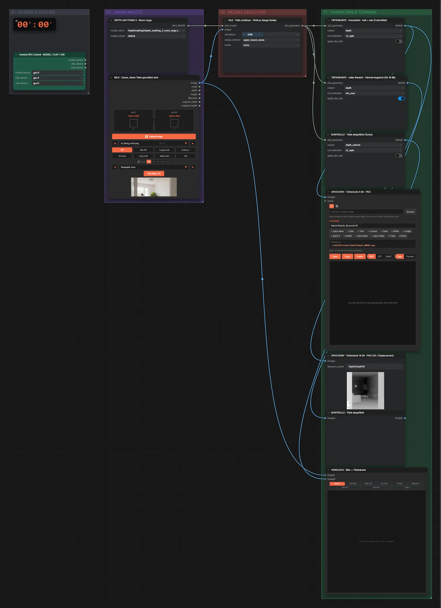
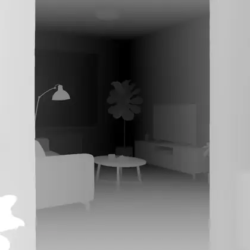
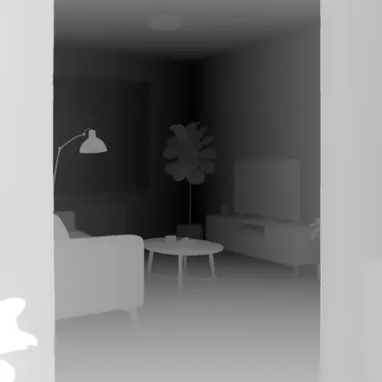

# Depth Anything 3 Large (FP32) · Bild → Tiefenkarte

**Workflow-Datei:** [`workflows/Pose & Depth/DepthAnything3_Large_FP32-Image-to-Depth.json`](../../../workflows/Pose%20%26%20Depth/DepthAnything3_Large_FP32-Image-to-Depth.json)  
**Kategorie:** Pose & Depth · **Eingabe → Ausgabe:** Bild → Tiefenkarte · **Quant:** FP32

Bis v1.3.0 hieß der Workflow `DepthAnything3-Depth-from-Image.json`.

Tiefenkarte als 8- und 16-Bit-PNG (für ControlNet, 3D oder Displacement) plus eingefärbte Kontrolle.

Interaktiv mit Zoom, Vergleichen und Kopier-Buttons: <https://dawasteh.github.io/DaWastehs-ComfyUI-Bundle/#/w/depthanything3-large-fp32-image-to-depth>

## Modelle

| Rolle | Datei | Quant | Größe |
|---|---|---|---:|
| Tiefenschätzung | `depth_anything_3_mono_large.safetensors` | FP32 | 1,2 GiB |

## Workflow in ComfyUI

Screenshot nach dem Hauptbeispiel (Eingaben und Ergebnis im Workflow, Erklärungstafeln ausgeblendet):

## Beispiele

### Bild → Tiefenkarte

| Einstellung | Wert |
|---|---|
| Dauer (Ausführung) | 2 s |
| VRAM R9700 (belegt / PyTorch-Spitze) | 9,1 GiB / 3,6 GiB |
| RAM (ComfyUI-Prozess) | 2,4 GiB |

Eingabe · ex_living_room.png:  ([Datei](input_ex_living_room.webp))  
Ausgabe · SPEICHERN · Tiefenkarte 8 Bit · PNG:  · [Volle Auflösung (1024×1024, WebP mit Workflow – per Drag & Drop in ComfyUI ladbar)](room__n5.webp)  
Ausgabe · SPEICHERN · Tiefenkarte 16 Bit · PNG (3D / Displacement): 
