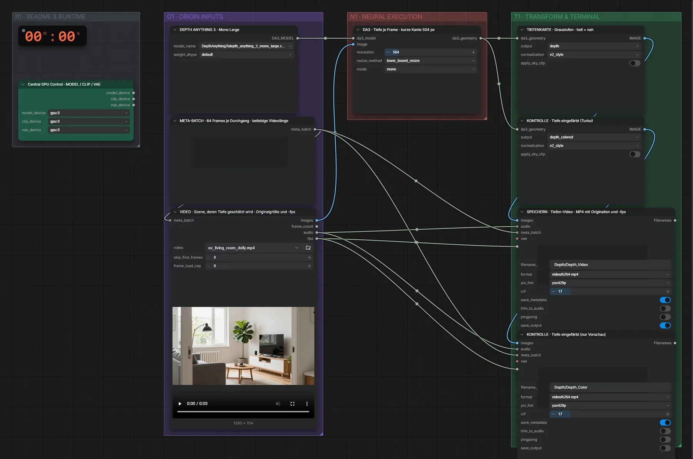

# Depth Anything 3 Large (FP32) · Video → Tiefenvideo

**Workflow-Datei:** [`workflows/Pose & Depth/DepthAnything3_Large_FP32-Video-to-Depth-Video.json`](../../../workflows/Pose%20%26%20Depth/DepthAnything3_Large_FP32-Video-to-Depth-Video.json)  
**Kategorie:** Pose & Depth · **Eingabe → Ausgabe:** Video → Video · **Quant:** FP32

Bis v1.3.0 hieß der Workflow `DepthAnything3-Depth-from-Video.json`.

Tiefe für jedes Frame, als MP4 mit Originalton und -fps.

Interaktiv mit Zoom, Vergleichen und Kopier-Buttons: <https://dawasteh.github.io/DaWastehs-ComfyUI-Bundle/#/w/depthanything3-large-fp32-video-to-depth-video>

## Modelle

| Rolle | Datei | Quant | Größe |
|---|---|---|---:|
| Tiefenschätzung | `depth_anything_3_mono_large.safetensors` | FP32 | 1,2 GiB |

## Workflow in ComfyUI

Screenshot nach dem Hauptbeispiel (Eingaben und Ergebnis im Workflow, Erklärungstafeln ausgeblendet):

## Beispiele

### Video → Tiefenvideo

| Einstellung | Wert |
|---|---|
| Dauer (Ausführung) | 26 s |
| VRAM R9700 (belegt / PyTorch-Spitze) | 17,6 GiB / 12,1 GiB |
| VRAM RX 9070 XT (belegt / PyTorch-Spitze) | 0,7 GiB / 0,1 GiB |
| RAM (ComfyUI-Prozess) | 10,2 GiB |

Eingabe · ex_living_room_dolly.mp4: [input_ex_living_room_dolly.mp4](input_ex_living_room_dolly.mp4)  
Ausgabe · SPEICHERN · Tiefen-Video · MP4 mit Originalton und -fps: [room.mp4](room.mp4)
