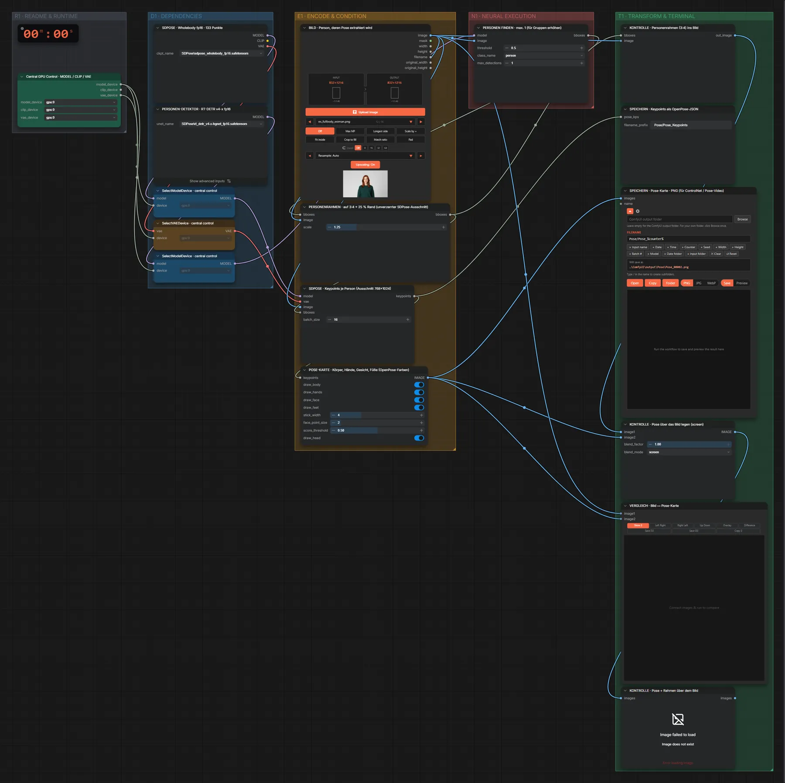
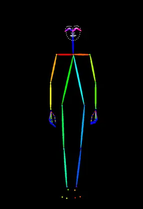

# SDPose WholeBody (FP16) · Bild → Pose

**Workflow-Datei:** [`workflows/Pose & Depth/SDPose_WholeBody_FP16-Image-to-Pose.json`](../../../workflows/Pose%20%26%20Depth/SDPose_WholeBody_FP16-Image-to-Pose.json)  
**Kategorie:** Pose & Depth · **Eingabe → Ausgabe:** Bild → Pose · **Quant:** FP16

Bis v1.3.0 hieß der Workflow `SDPose-Pose-from-Image.json`.

Ganzkörper-Keypoints (Körper, Hände, Gesicht) als Pose-Karte und OpenPose-JSON.

Interaktiv mit Zoom, Vergleichen und Kopier-Buttons: <https://dawasteh.github.io/DaWastehs-ComfyUI-Bundle/#/w/sdpose-wholebody-fp16-image-to-pose>

## Modelle

| Rolle | Datei | Quant | Größe |
|---|---|---|---:|
| Modell | `sdpose_wholebody_fp16.safetensors` | FP16 | 1,8 GiB |
| Diffusionsmodell | `rt_detr_v4-x-hgnet_fp16.safetensors` | FP16 | 0,1 GiB |

## Workflow in ComfyUI

Screenshot nach dem Hauptbeispiel (Eingaben und Ergebnis im Workflow, Erklärungstafeln ausgeblendet):

## Beispiele

### Bild → Pose

| Einstellung | Wert |
|---|---|
| Dauer (Ausführung) | 4 s |
| VRAM R9700 (belegt / PyTorch-Spitze) | 24,2 GiB / 14,9 GiB |
| RAM (ComfyUI-Prozess) | 28,3 GiB |

Eingabe · ex_fullbody_woman.png:  ([Datei](input_ex_fullbody_woman.webp))  
Ausgabe · SPEICHERN · Pose-Karte · PNG (für ControlNet / Pose-Video):  · [Volle Auflösung (832×1216, WebP mit Workflow – per Drag & Drop in ComfyUI ladbar)](woman.webp)
