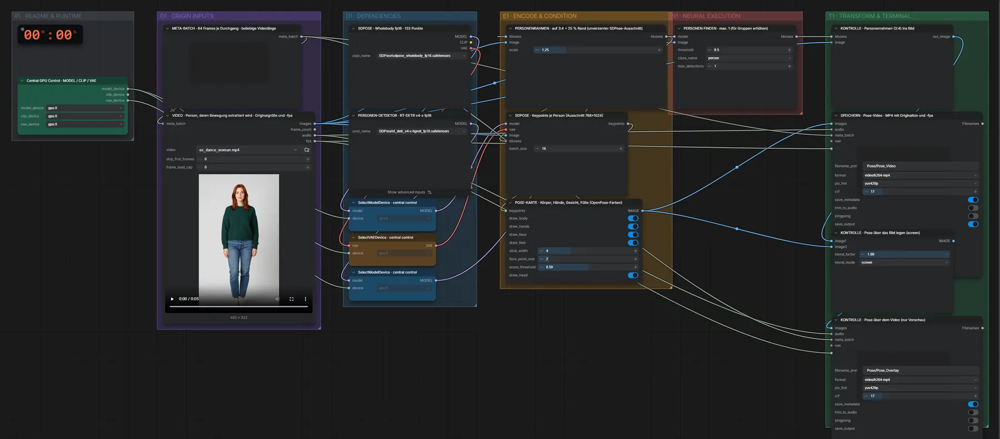

# SDPose WholeBody (FP16) · Video → Pose-Video

**Workflow-Datei:** [`workflows/Pose & Depth/SDPose_WholeBody_FP16-Video-to-Pose-Video.json`](../../../workflows/Pose%20%26%20Depth/SDPose_WholeBody_FP16-Video-to-Pose-Video.json)  
**Kategorie:** Pose & Depth · **Eingabe → Ausgabe:** Video → Video · **Quant:** FP16

Bis v1.3.0 hieß der Workflow `SDPose-Pose-from-Video.json`.

Pose für jedes Frame – z. B. als Steuervideo für WAN Fun Control oder SCAIL.

Interaktiv mit Zoom, Vergleichen und Kopier-Buttons: <https://dawasteh.github.io/DaWastehs-ComfyUI-Bundle/#/w/sdpose-wholebody-fp16-video-to-pose-video>

## Modelle

| Rolle | Datei | Quant | Größe |
|---|---|---|---:|
| Modell | `sdpose_wholebody_fp16.safetensors` | FP16 | 1,8 GiB |
| Diffusionsmodell | `rt_detr_v4-x-hgnet_fp16.safetensors` | FP16 | 0,1 GiB |

## Workflow in ComfyUI

Screenshot nach dem Hauptbeispiel (Eingaben und Ergebnis im Workflow, Erklärungstafeln ausgeblendet):

## Beispiele

### Video → Pose-Video

| Einstellung | Wert |
|---|---|
| Dauer (Ausführung) | 30 s |
| VRAM R9700 (belegt / PyTorch-Spitze) | 6,7 GiB / 4,2 GiB |
| RAM (ComfyUI-Prozess) | 5,5 GiB |

Eingabe · ex_dance_woman.mp4: [input_ex_dance_woman.mp4](input_ex_dance_woman.mp4)  
Ausgabe · SPEICHERN · Pose-Video · MP4 mit Originalton und -fps: [dance.mp4](dance.mp4)
