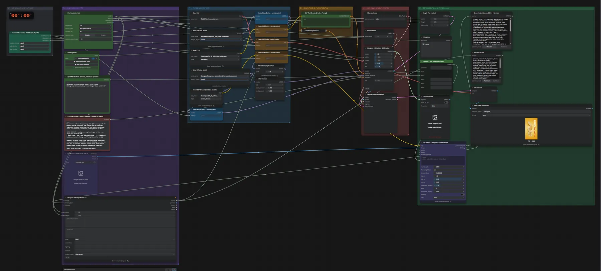
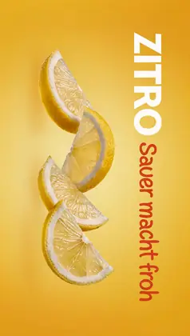

# Ideogram 4 (FP8) + Qwen3.5 4B · Idee → JSON → Bild

**Workflow-Datei:** [`workflows/Prompt Enhancer/Ideogram4_FP8+Qwen3_5_4B-Idea-to-Prompt-to-Image.json`](../../../workflows/Prompt%20Enhancer/Ideogram4_FP8%2BQwen3_5_4B-Idea-to-Prompt-to-Image.json)  
**Kategorie:** Prompt Enhancer · **Eingabe → Ausgabe:** Text → Prompt + Bild · **Quant:** FP8

Bis v1.3.0 hieß der Workflow `Ideogram4_Qwen3_5-Auto-Prompt-to-Image.json`.

Qwen3.5 macht aus einer deutschen Bildidee das strukturierte Ideogram-JSON, Ideogram 4 rendert das Bild.

Interaktiv mit Zoom, Vergleichen und Kopier-Buttons: <https://dawasteh.github.io/DaWastehs-ComfyUI-Bundle/#/w/ideogram4-fp8-qwen3-5-4b-idea-to-prompt-to-image>

## Modelle

| Rolle | Datei | Quant | Größe |
|---|---|---|---:|
| Diffusionsmodell | `ideogram4_unconditional_fp8_scaled.safetensors` | FP8 | 8,6 GiB |
| Diffusionsmodell | `ideogram4_fp8_scaled.safetensors` | FP8 | 8,6 GiB |
| Text-Encoder / LLM | `qwen3vl_8b_fp8_scaled.safetensors` | FP8 | 9,9 GiB |
| VAE | `flux2-vae.safetensors` | FP32 | 0,3 GiB |
| Text-Encoder / LLM | `qwen3.5_4b_bf16.safetensors` | BF16 | 8,7 GiB |

## Workflow in ComfyUI

Screenshot nach dem Hauptbeispiel (Eingaben und Ergebnis im Workflow, Erklärungstafeln ausgeblendet):

[](workflow.webp)

## Beispiele

### Idee → Ideogram-JSON → Bild

Prompt:

```text
Werbeplakat für eine Limonade namens "ZITRO": gelber Hintergrund, Zitronenscheiben, frecher Slogan "Sauer macht froh"
```

| Einstellung | Wert |
|---|---|
| seed | 42 |
| sampler_name | euler |
| shift | 1.0 |
| Dauer (Ausführung) | 1 min 38 s |
| VRAM R9700 (belegt / PyTorch-Spitze) | 29,7 GiB / 24,1 GiB |
| RAM (ComfyUI-Prozess) | 24,2 GiB |

Ausgabe · Ausgabe: [](zitro.webp) · [Volle Auflösung (752×1328, WebP mit Workflow – per Drag & Drop in ComfyUI ladbar)](zitro.webp)  

easy showAnything:

```text
752 x 1328
```

Qwen-Output (rohes JSON) — Kontrolle:

```text
{"aspect_ratio":"3:4","high_level_description":"A vibrant 3D render advertisement poster for ZITRO lemonade featuring a bright yellow background, floating lemon slices, and the playful slogan Sauer macht froh in bold typography.","compositional_deconstruction":{"background":"A solid bright lemon-yellow gradient background with subtle radial lighting from center to edges, no scene elements or props, clean studio lighting setup","elements":[{"type":"obj","bbox":[150,200,850,600],"desc":"A cluster of three translucent fresh lemon slices arranged diagonally, varying sizes with visible pulp texture and bright yellow rind, floating in mid-air against the yellow backdrop"},{"type":"text","bbox":[100,700,900,850],"text":"ZITRO\nSauer macht froh","desc":"Bold sans-serif typography with ZITRO in large white uppercase letters at top, followed by Sauer macht froh in smaller orange-red playful font below"}]},"compositional_deconstruction":{"background":"A solid bright lemon-yellow gradient background with subtle radial lighting from center to edges, no scene elements or props, clean studio lighting setup","elements":[{"type":"obj","bbox":[150,200,850,600],"desc":"A cluster of three translucent fresh lemon slices arranged diagonally, varying sizes with visible pulp texture and bright yellow rind, floating in mid-air against the yellow backdrop"},{"type":"text","bbox":[100,700,900,850],"text":"ZITRO\nSauer macht froh","desc":"Bold sans-serif typography with ZITRO in large white uppercase letters at top, followed by Sauer macht froh in smaller orange-red playful font below"}]}}
```

PreviewAny:

```text
{"aspect_ratio":"3:4","high_level_description":"A vibrant 3D render advertisement poster for ZITRO lemonade featuring a bright yellow background, floating lemon slices, and the playful slogan Sauer macht froh in bold typography.","compositional_deconstruction":{"background":"A solid bright lemon-yellow gradient background with subtle radial lighting from center to edges, no scene elements or props, clean studio lighting setup","elements":[{"type":"obj","bbox":[150,200,850,600],"desc":"A cluster of three translucent fresh lemon slices arranged diagonally, varying sizes with visible pulp texture and bright yellow rind, floating in mid-air against the yellow backdrop"},{"type":"text","bbox":[100,700,900,850],"text":"ZITRO\nSauer macht froh","desc":"Bold sans-serif typography with ZITRO in large white uppercase letters at top, followed by Sauer macht froh in smaller orange-red playful font below"}]}}
```
