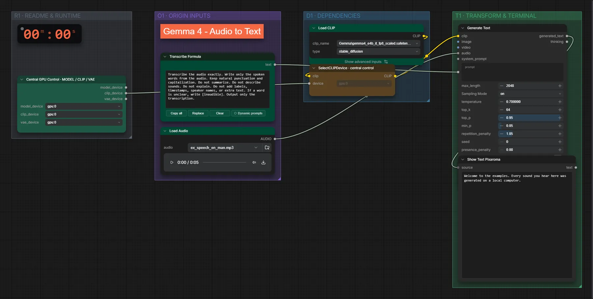

# Gemma 4 e4B (FP8) · Sprache → Text

**Workflow-Datei:** [`workflows/Prompt Enhancer/LLM_Gemma4_E4B_FP8-Audio-to-Text.json`](../../../workflows/Prompt%20Enhancer/LLM_Gemma4_E4B_FP8-Audio-to-Text.json)  
**Kategorie:** Prompt Enhancer · **Eingabe → Ausgabe:** Audio → Text · **Quant:** FP8

Bis v1.3.0 hieß der Workflow `LLM_Gemma4_e4b-Audio-to-Text.json`.

Transkribiert eine Aufnahme wortgetreu.

Interaktiv mit Zoom, Vergleichen und Kopier-Buttons: <https://dawasteh.github.io/DaWastehs-ComfyUI-Bundle/#/w/llm-gemma4-e4b-fp8-audio-to-text>

## Modelle

| Rolle | Datei | Quant | Größe |
|---|---|---|---:|
| Text-Encoder / LLM | `gemma4_e4b_it_fp8_scaled.safetensors` | FP8 | 8,4 GiB |

## Workflow in ComfyUI

Screenshot nach dem Hauptbeispiel (Eingaben und Ergebnis im Workflow, Erklärungstafeln ausgeblendet):

[](workflow.webp)

## Beispiele

### Sprache → Text

| Einstellung | Wert |
|---|---|
| Dauer (Ausführung) | 10 s |
| VRAM R9700 (belegt / PyTorch-Spitze) | 13,7 GiB / 9,9 GiB |
| RAM (ComfyUI-Prozess) | 10,1 GiB |

Eingabe · ex_speech_en_man.mp3: [input_ex_speech_en_man.mp3](input_ex_speech_en_man.mp3)  

PixaromaShowText:

```text
Welcome to the examples. Every sound you hear here was generated on a local computer.
```
