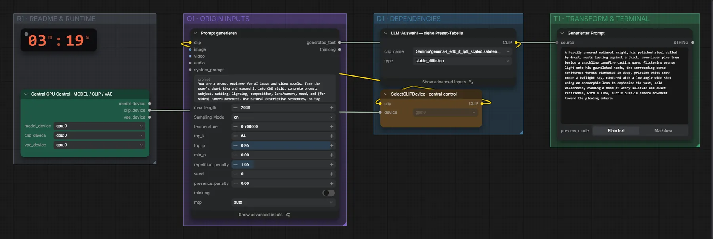

# Gemma 4 e4B (FP8) · Idee → Prompt

**Workflow-Datei:** [`workflows/Prompt Enhancer/LLM_Gemma4_E4B_FP8-Idea-to-Prompt.json`](../../../workflows/Prompt%20Enhancer/LLM_Gemma4_E4B_FP8-Idea-to-Prompt.json)  
**Kategorie:** Prompt Enhancer · **Eingabe → Ausgabe:** Text → Prompt · **Quant:** FP8

Bis v1.3.0 hieß der Workflow `LLM_General-Prompt-Enhancer.json`.

Allgemeiner Prompt-Enhancer für Bild- und Videomodelle.

Interaktiv mit Zoom, Vergleichen und Kopier-Buttons: <https://dawasteh.github.io/DaWastehs-ComfyUI-Bundle/#/w/llm-gemma4-e4b-fp8-idea-to-prompt>

## Modelle

| Rolle | Datei | Quant | Größe |
|---|---|---|---:|
| Text-Encoder / LLM | `gemma4_e4b_it_fp8_scaled.safetensors` | FP8 | 8,4 GiB |

## Workflow in ComfyUI

Screenshot nach dem Hauptbeispiel (Eingaben und Ergebnis im Workflow, Erklärungstafeln ausgeblendet):

[](workflow.webp)

## Beispiele

### Idee → Prompt

Prompt:

```text
a knight resting by a campfire in a snowy forest
```

| Einstellung | Wert |
|---|---|
| Dauer (Ausführung) | 17 s |
| VRAM R9700 (belegt / PyTorch-Spitze) | 13,3 GiB / 9,9 GiB |
| RAM (ComfyUI-Prozess) | 9,4 GiB |


Generierter Prompt:

```text
A heavily armored medieval knight, his polished steel dulled by frost, rests leaning against a thick, snow-laden pine tree beside a crackling campfire casting warm, flickering orange light onto his gauntleted hands, the surrounding dense coniferous forest blanketed in deep, pristine white snow under a twilight sky, captured with a low-angle wide shot using an anamorphic lens to emphasize the vast, cold wilderness, evoking a mood of weary solitude and quiet resilience, with a slow, subtle push-in camera movement toward the glowing embers.
```

### Idee → Prompt

Prompt:

```text
drone flight over a neon city at night, for a video
```

| Einstellung | Wert |
|---|---|
| Dauer (Ausführung) | 5 s |
| VRAM R9700 (belegt / PyTorch-Spitze) | 13,3 GiB / 9,9 GiB |
| RAM (ComfyUI-Prozess) | 9,4 GiB |


Generierter Prompt:

```text
A sweeping, cinematic drone shot descends through a dense, rain-slicked metropolis at midnight, where towering skyscrapers pulse with vibrant neon signs casting streaks of electric blue, hot pink, and acid green across the wet asphalt below; the low-hanging clouds catch the reflected light, creating a moody, cyberpunk atmosphere, captured with a wide-angle anamorphic lens to emphasize the dizzying scale, with a slow, majestic upward crane shot revealing the vastness of the illuminated urban sprawl.
```
