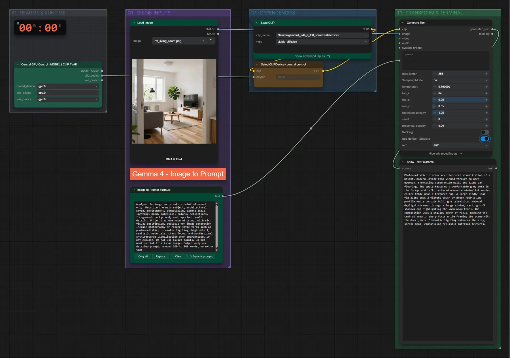

# Gemma 4 e4B (FP8) · Bild → Prompt

**Workflow-Datei:** [`workflows/Prompt Enhancer/LLM_Gemma4_E4B_FP8-Image-to-Prompt.json`](../../../workflows/Prompt%20Enhancer/LLM_Gemma4_E4B_FP8-Image-to-Prompt.json)  
**Kategorie:** Prompt Enhancer · **Eingabe → Ausgabe:** Bild → Prompt · **Quant:** FP8

Bis v1.3.0 hieß der Workflow `LLM_Gemma4_e4b-Image-to-Prompt.json`.

Beschreibt ein Bild als Prompt zum Nachbauen.

Interaktiv mit Zoom, Vergleichen und Kopier-Buttons: <https://dawasteh.github.io/DaWastehs-ComfyUI-Bundle/#/w/llm-gemma4-e4b-fp8-image-to-prompt>

## Modelle

| Rolle | Datei | Quant | Größe |
|---|---|---|---:|
| Text-Encoder / LLM | `gemma4_e4b_it_fp8_scaled.safetensors` | FP8 | 8,4 GiB |

## Workflow in ComfyUI

Screenshot nach dem Hauptbeispiel (Eingaben und Ergebnis im Workflow, Erklärungstafeln ausgeblendet):

[](workflow.webp)

## Beispiele

### Bild → Prompt

| Einstellung | Wert |
|---|---|
| Dauer (Ausführung) | 21 s |
| VRAM R9700 (belegt / PyTorch-Spitze) | 13,7 GiB / 9,9 GiB |
| RAM (ComfyUI-Prozess) | 9,8 GiB |

Eingabe · ex_living_room.png:  ([Datei](input_ex_living_room.webp))  

PixaromaShowText:

```text
Photorealistic interior architectural visualization of a bright, modern living room viewed through an open doorway, showcasing clean white walls and light oak flooring. The space features a comfortable grey sofa in the foreground left, centered around a minimalist wooden coffee table upon a textured rug. A large fiddle-leaf fig plant adds a vibrant touch of green near a low-profile media console holding a television. Natural daylight streams through a large window, casting soft shadows and highlighting the warm wood tones. The composition uses a shallow depth of field, keeping the central area in sharp focus while framing the scene with the door jambs. Cinematic lighting enhances the airy, serene mood, emphasizing realistic material textures.
```
