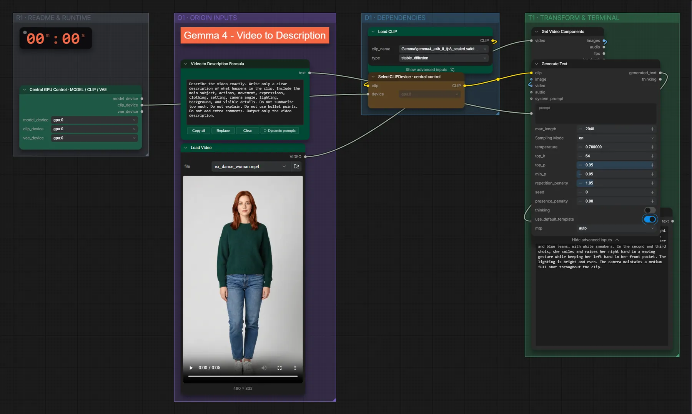

# Gemma 4 e4B (FP8) · Video → Beschreibung

**Workflow-Datei:** [`workflows/Prompt Enhancer/LLM_Gemma4_E4B_FP8-Video-to-Description.json`](../../../workflows/Prompt%20Enhancer/LLM_Gemma4_E4B_FP8-Video-to-Description.json)  
**Kategorie:** Prompt Enhancer · **Eingabe → Ausgabe:** Video → Text · **Quant:** FP8

Bis v1.3.0 hieß der Workflow `LLM_Gemma4_e4b-Video-to-Description.json`.

Beschreibt, was im Video passiert.

Interaktiv mit Zoom, Vergleichen und Kopier-Buttons: <https://dawasteh.github.io/DaWastehs-ComfyUI-Bundle/#/w/llm-gemma4-e4b-fp8-video-to-description>

## Modelle

| Rolle | Datei | Quant | Größe |
|---|---|---|---:|
| Text-Encoder / LLM | `gemma4_e4b_it_fp8_scaled.safetensors` | FP8 | 8,4 GiB |

## Workflow in ComfyUI

Screenshot nach dem Hauptbeispiel (Eingaben und Ergebnis im Workflow, Erklärungstafeln ausgeblendet):

[](workflow.webp)

## Beispiele

### Video → Beschreibung

| Einstellung | Wert |
|---|---|
| Dauer (Ausführung) | 13 s |
| VRAM R9700 (belegt / PyTorch-Spitze) | 13,2 GiB / 9,9 GiB |
| RAM (ComfyUI-Prozess) | 10,4 GiB |

Eingabe · ex_dance_woman.mp4: [input_ex_dance_woman.mp4](input_ex_dance_woman.mp4)  

PixaromaShowText:

```text
A woman with reddish-brown hair stands against a plain light gray background. In the first shot, she is standing still, facing the camera, wearing a dark green long-sleeved sweater and blue jeans, with white sneakers. In the second and third shots, she smiles and raises her right hand in a waving gesture while keeping her left hand in her front pocket. The lighting is bright and even. The camera maintains a medium full shot throughout the clip.
```
