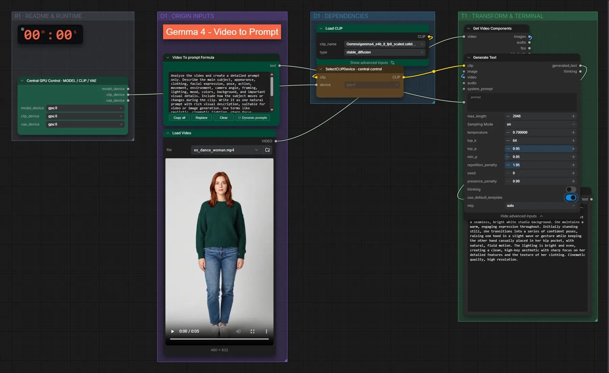

# Gemma 4 e4B (FP8) · Video → Prompt

**Workflow-Datei:** [`workflows/Prompt Enhancer/LLM_Gemma4_E4B_FP8-Video-to-Prompt.json`](../../../workflows/Prompt%20Enhancer/LLM_Gemma4_E4B_FP8-Video-to-Prompt.json)  
**Kategorie:** Prompt Enhancer · **Eingabe → Ausgabe:** Video → Prompt · **Quant:** FP8

Bis v1.3.0 hieß der Workflow `LLM_Gemma4_e4b-Video-to-Prompt.json`.

Formuliert ein Video als Prompt für Videomodelle.

Interaktiv mit Zoom, Vergleichen und Kopier-Buttons: <https://dawasteh.github.io/DaWastehs-ComfyUI-Bundle/#/w/llm-gemma4-e4b-fp8-video-to-prompt>

## Modelle

| Rolle | Datei | Quant | Größe |
|---|---|---|---:|
| Text-Encoder / LLM | `gemma4_e4b_it_fp8_scaled.safetensors` | FP8 | 8,4 GiB |

## Workflow in ComfyUI

Screenshot nach dem Hauptbeispiel (Eingaben und Ergebnis im Workflow, Erklärungstafeln ausgeblendet):

[](workflow.webp)

## Beispiele

### Video → Prompt

| Einstellung | Wert |
|---|---|
| Dauer (Ausführung) | 14 s |
| VRAM R9700 (belegt / PyTorch-Spitze) | 13,2 GiB / 9,9 GiB |
| RAM (ComfyUI-Prozess) | 10,4 GiB |

Eingabe · ex_dance_woman.mp4: [input_ex_dance_woman.mp4](input_ex_dance_woman.mp4)  

PixaromaShowText:

```text
A realistic, full-body shot of a young woman with shoulder-length auburn hair, wearing a dark emerald green knitted sweater and fitted light blue denim jeans, standing against a seamless, bright white studio background. She maintains a warm, engaging expression throughout. Initially standing still, she transitions into a series of confident poses, raising one hand in a slight wave or gesture while keeping the other hand casually placed in her hip pocket, with natural, fluid motion. The lighting is bright and even, creating a clean, high-key aesthetic with sharp focus on her detailed features and the texture of her clothing. Cinematic quality, high resolution.
```
