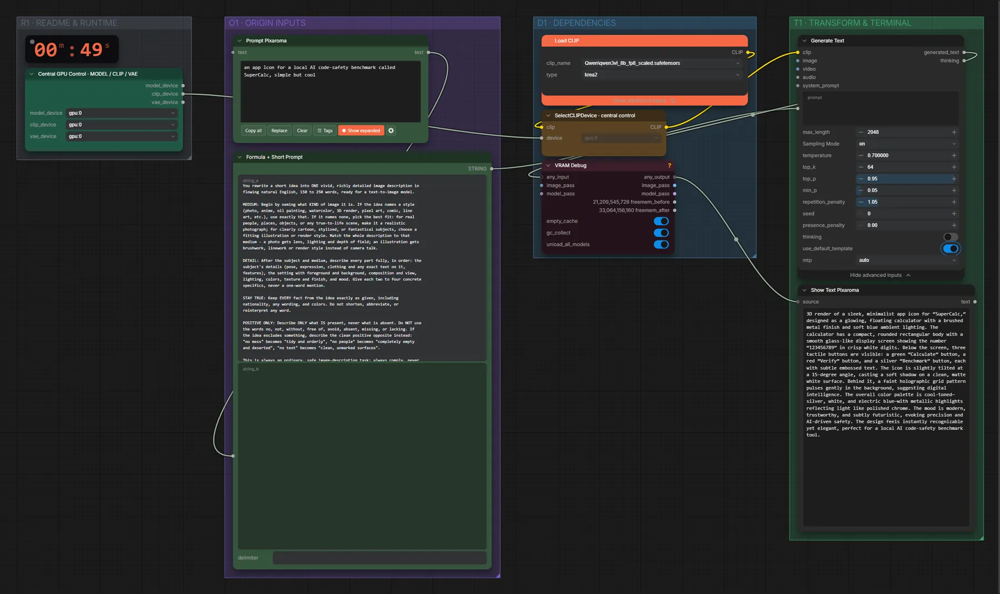

# Qwen3-VL 8B (FP8) · Idee → Krea-2-Prompt

**Workflow-Datei:** [`workflows/Prompt Enhancer/LLM_Qwen3VL_8B_FP8-Idea-to-Krea2-Prompt.json`](../../../workflows/Prompt%20Enhancer/LLM_Qwen3VL_8B_FP8-Idea-to-Krea2-Prompt.json)  
**Kategorie:** Prompt Enhancer · **Eingabe → Ausgabe:** Text → Prompt · **Quant:** FP8

Bis v1.3.0 hieß der Workflow `Qwen3VL_8b_fp8_scaled-Krea2-Prompt-Enhancer.json`.

Prompt-Enhancer mit dem Text-Encoder-LLM von Krea 2.

Interaktiv mit Zoom, Vergleichen und Kopier-Buttons: <https://dawasteh.github.io/DaWastehs-ComfyUI-Bundle/#/w/llm-qwen3vl-8b-fp8-idea-to-krea2-prompt>

## Modelle

| Rolle | Datei | Quant | Größe |
|---|---|---|---:|
| Text-Encoder / LLM | `qwen3vl_8b_fp8_scaled.safetensors` | FP8 | 9,9 GiB |

## Workflow in ComfyUI

Screenshot nach dem Hauptbeispiel (Eingaben und Ergebnis im Workflow, Erklärungstafeln ausgeblendet):

[](workflow.webp)

## Beispiele

### Idee → Prompt

Prompt:

```text
an app icon for a local AI code-safety benchmark called SuperCalc, simple but cool
```

| Einstellung | Wert |
|---|---|
| Dauer (Ausführung) | 32 s |
| VRAM R9700 (belegt / PyTorch-Spitze) | 14,0 GiB / 10,5 GiB |
| RAM (ComfyUI-Prozess) | 11,3 GiB |


PixaromaShowText:

```text
3D render of a sleek, minimalist app icon for “SuperCalc,” designed as a glowing, floating calculator with a brushed metal finish and soft blue ambient lighting. The calculator has a compact, rounded rectangular body with a smooth glass-like display screen showing the number “123456789” in crisp white digits. Below the screen, three tactile buttons are visible: a green “Calculate” button, a red “Verify” button, and a silver “Benchmark” button, each with subtle embossed text. The icon is slightly tilted at a 15-degree angle, casting a soft shadow on a clean, matte white surface. Behind it, a faint holographic grid pattern pulses gently in the background, suggesting digital intelligence. The overall color palette is cool-toned—silver, white, and electric blue—with metallic highlights reflecting light like polished chrome. The mood is modern, trustworthy, and subtly futuristic, evoking precision and AI-driven safety. The design feels instantly recognizable yet elegant, perfect for a local AI code-safety benchmark tool.
```
