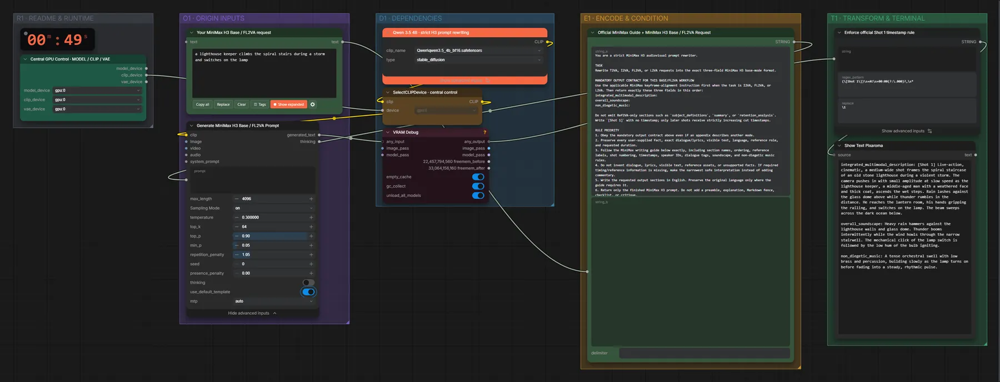

# Qwen3.5 4B · Idee → MiniMax-H3-Prompt (FL2VA)

**Workflow-Datei:** [`workflows/Prompt Enhancer/LLM_Qwen3_5_4B_BF16-Idea-to-H3-FL2VA-Prompt.json`](../../../workflows/Prompt%20Enhancer/LLM_Qwen3_5_4B_BF16-Idea-to-H3-FL2VA-Prompt.json)  
**Kategorie:** Prompt Enhancer · **Eingabe → Ausgabe:** Text → Prompt · **Quant:** BF16

Bis v1.3.0 hieß der Workflow `MiniMax_H3_Base_FL2VA-Official-Guide-Prompt-Enhancer.json`.

Schreibt Prompts nach dem offiziellen H3-Guide für Base- und First/Last-Frame-Videos.

Interaktiv mit Zoom, Vergleichen und Kopier-Buttons: <https://dawasteh.github.io/DaWastehs-ComfyUI-Bundle/#/w/llm-qwen3-5-4b-bf16-idea-to-h3-fl2va-prompt>

## Modelle

| Rolle | Datei | Quant | Größe |
|---|---|---|---:|
| Text-Encoder / LLM | `qwen3.5_4b_bf16.safetensors` | BF16 | 8,7 GiB |

## Workflow in ComfyUI

Screenshot nach dem Hauptbeispiel (Eingaben und Ergebnis im Workflow, Erklärungstafeln ausgeblendet):

[](workflow.webp)

## Beispiele

### Idee → Prompt

Prompt:

```text
a lighthouse keeper climbs the spiral stairs during a storm and switches on the lamp
```

| Einstellung | Wert |
|---|---|
| Dauer (Ausführung) | 15 s |
| VRAM R9700 (belegt / PyTorch-Spitze) | 12,7 GiB / 10,2 GiB |
| RAM (ComfyUI-Prozess) | 10,1 GiB |


PixaromaShowText:

```text
integrated_multimodal_description: [Shot 1] Live-action, cinematic, a medium-wide shot frames the spiral staircase of an old stone lighthouse during a violent storm. The camera pushes in with small amplitude at slow speed as the lighthouse keeper, a middle-aged man with a weathered face and thick coat, ascends the wet steps. Rain lashes against the glass dome above while thunder rumbles in the distance. He reaches the lantern room, his hands gripping the railing, and switches on the lamp. The beam sweeps across the dark ocean below.

overall_soundscape: Heavy rain hammers against the lighthouse walls and glass dome. Thunder booms intermittently while the wind howls through the narrow stairwell. The mechanical click of the lamp switch is followed by the low hum of the bulb igniting.

non_diegetic_music: A tense orchestral swell with low brass and percussion, building slowly as the lamp turns on before fading into a steady, rhythmic pulse.
```
