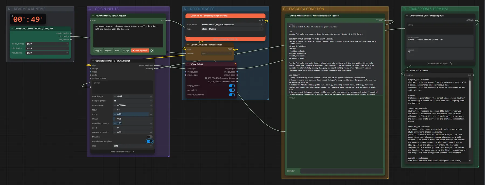

# Qwen3.5 4B · Idee → MiniMax-H3-Prompt (Ref2VA)

**Workflow-Datei:** [`workflows/Prompt Enhancer/LLM_Qwen3_5_4B_BF16-Idea-to-H3-Ref2VA-Prompt.json`](../../../workflows/Prompt%20Enhancer/LLM_Qwen3_5_4B_BF16-Idea-to-H3-Ref2VA-Prompt.json)  
**Kategorie:** Prompt Enhancer · **Eingabe → Ausgabe:** Text → Prompt · **Quant:** BF16

Bis v1.3.0 hieß der Workflow `MiniMax_H3_Ref2VA-Official-Guide-Prompt-Enhancer.json`.

Schreibt Ref2VA-Prompts mit <Picture n>/<Video n>/<Audio n>-Verweisen.

Interaktiv mit Zoom, Vergleichen und Kopier-Buttons: <https://dawasteh.github.io/DaWastehs-ComfyUI-Bundle/#/w/llm-qwen3-5-4b-bf16-idea-to-h3-ref2va-prompt>

## Modelle

| Rolle | Datei | Quant | Größe |
|---|---|---|---:|
| Text-Encoder / LLM | `qwen3.5_4b_bf16.safetensors` | BF16 | 8,7 GiB |

## Workflow in ComfyUI

Screenshot nach dem Hauptbeispiel (Eingaben und Ergebnis im Workflow, Erklärungstafeln ausgeblendet):

[](workflow.webp)

## Beispiele

### Idee → Prompt

Prompt:

```text
the woman from my reference photo orders a coffee in a busy café and laughs with the barista
```

| Einstellung | Wert |
|---|---|
| Dauer (Ausführung) | 21 s |
| VRAM R9700 (belegt / PyTorch-Spitze) | 15,6 GiB / 11,7 GiB |
| RAM (ComfyUI-Prozess) | 10,1 GiB |


PixaromaShowText:

```text
subject_definitions:
<Subject 1> is the woman from the reference photo, with a casual appearance and expressive face.
<Picture 1> is the reference photo of the woman in the café setting.

summary:
[reference generation] The target video shows <Subject 1> ordering a coffee in a busy café and laughing with the barista.

retention_analysis:
<Subject 1> (appears in [Shot 1]): fully_preserved - the woman's appearance and expression are retained.
<Picture 1> ([Shot 1] first frame): fully_preserved - the reference photo serves as the initial composition anchor.

detailed_description:
The target video uses a realistic multi-camera café style with warm indoor lighting.
[Shot 1] A medium shot establishes <Subject 1>, the woman from the reference photo, standing at a café counter. She holds a menu and looks toward the barista. The camera slowly pushes in with small amplitude at slow speed as she places her order. The barista responds with a friendly tone, and <Subject 1> smiles and laughs. The scene captures the lively atmosphere of the busy café with background chatter and movement.

overall_soundscape:
Soft café ambience continues throughout the scene, including low chatter, clinking cups, and the hum of espresso machines.

non_diegetic_music:
N/A
```
