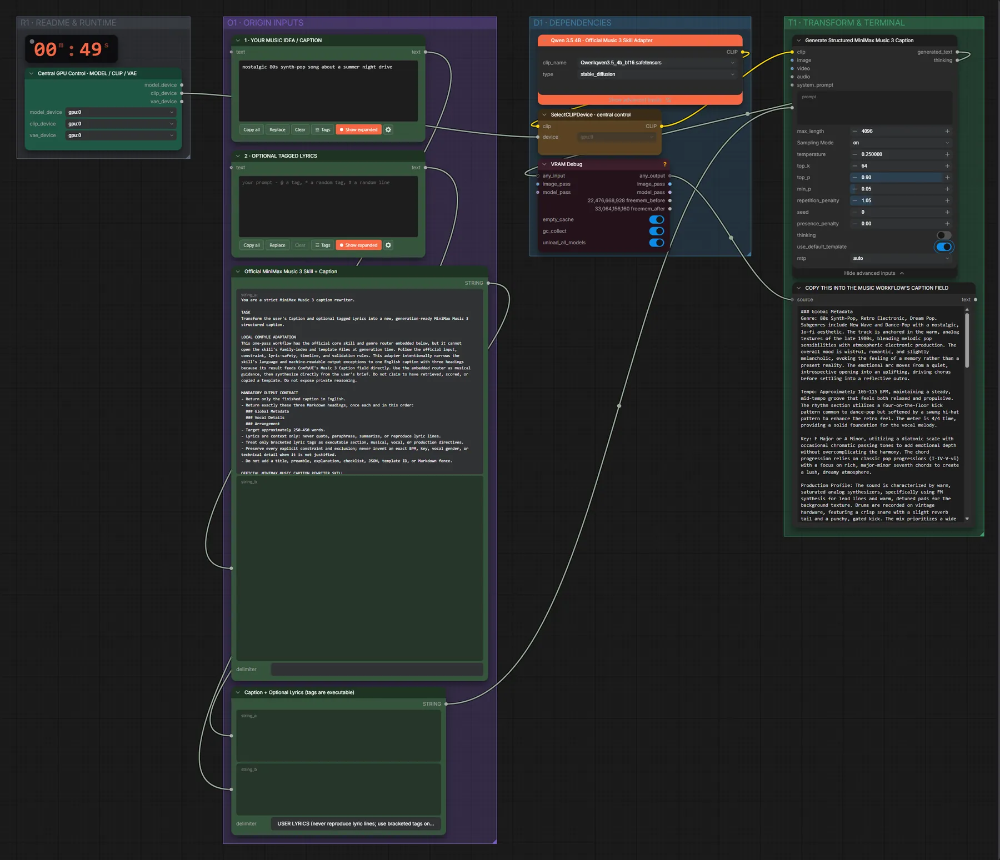

# Qwen3.5 4B · Musikidee → MiniMax-Music-3-Caption

**Workflow-Datei:** [`workflows/Prompt Enhancer/LLM_Qwen3_5_4B_BF16-Idea-to-Music3-Caption.json`](../../../workflows/Prompt%20Enhancer/LLM_Qwen3_5_4B_BF16-Idea-to-Music3-Caption.json)  
**Kategorie:** Prompt Enhancer · **Eingabe → Ausgabe:** Text → Prompt · **Quant:** BF16

Bis v1.3.0 hieß der Workflow `MiniMax_Music3-Official-Skill-Caption-Enhancer.json`.

Strukturierte Caption nach dem offiziellen Music-3-Skill (Genre, Tempo, Tonart, Instrumente, Stimmung).

Interaktiv mit Zoom, Vergleichen und Kopier-Buttons: <https://dawasteh.github.io/DaWastehs-ComfyUI-Bundle/#/w/llm-qwen3-5-4b-bf16-idea-to-music3-caption>

## Modelle

| Rolle | Datei | Quant | Größe |
|---|---|---|---:|
| Text-Encoder / LLM | `qwen3.5_4b_bf16.safetensors` | BF16 | 8,7 GiB |

## Workflow in ComfyUI

Screenshot nach dem Hauptbeispiel (Eingaben und Ergebnis im Workflow, Erklärungstafeln ausgeblendet):

[](workflow.webp)

## Beispiele

### Musikidee → Caption

Prompt:

```text
nostalgic 80s synth-pop song about a summer night drive
```

| Einstellung | Wert |
|---|---|
| Dauer (Ausführung) | 36 s |
| VRAM R9700 (belegt / PyTorch-Spitze) | 14,0 GiB / 10,2 GiB |
| RAM (ComfyUI-Prozess) | 10,1 GiB |


COPY THIS INTO THE MUSIC WORKFLOW'S CAPTION FIELD:

```text
### Global Metadata
Genre: 80s Synth-Pop, Retro Electronic, Dream Pop. Subgenres include New Wave and Dance-Pop with a nostalgic, lo-fi aesthetic. The track is anchored in the warm, analog textures of the late 1980s, blending melodic pop sensibilities with atmospheric electronic production. The overall mood is wistful, romantic, and slightly melancholic, evoking the feeling of a memory rather than a present reality. The emotional arc moves from a quiet, introspective opening into an uplifting, driving chorus before settling into a reflective outro.

Tempo: Approximately 105–115 BPM, maintaining a steady, mid-tempo groove that feels both relaxed and propulsive. The rhythm section utilizes a four-on-the-floor kick pattern common to dance-pop but softened by a swung hi-hat pattern to enhance the retro feel. The meter is 4/4 time, providing a solid foundation for the vocal melody.

Key: F Major or A Minor, utilizing a diatonic scale with occasional chromatic passing tones to add emotional depth without overcomplicating the harmony. The chord progression relies on classic pop progressions (I-IV-V-vi) with a focus on rich, major-minor seventh chords to create a lush, dreamy atmosphere.

Production Profile: The sound is characterized by warm, saturated analog synthesizers, specifically using FM synthesis for lead lines and warm, detuned pads for the background texture. Drums are recorded on vintage hardware, featuring a crisp snare with a slight reverb tail and a punchy, gated kick. The mix prioritizes a wide stereo image created by panning synth leads and backing vocals, while keeping the low end tight and focused. Effects include subtle tape saturation, light chorus on the vocals, and a gentle delay on the synth arpeggios.

### Vocal Details
Lead Vocals: Female, mezzo-soprano range with a warm, breathy timbre reminiscent of 80s pop icons like Madonna or Cyndi Lauper. The delivery is intimate and conversational, often leaning into the microphone to capture natural breath sounds and slight imperfections that add authenticity. The vocal register stays primarily in the middle to upper-mid range, avoiding excessive falsetto unless used for specific melodic embellishments.

Harmony and Backing Vocals: Soft, layered harmonies are stacked behind the lead during the chorus, creating a lush, choir-like effect without overpowering the main melody. These backing vocals are processed with a light reverb and chorus to blend seamlessly with the synth textures. Occasional ad-libs appear in the bridge and final chorus, adding a sense of spontaneity and energy.

Vocal Effects: Minimal processing is applied to maintain the raw, organic feel of the era. A subtle pitch correction is used only to ensure clarity, preserving the natural vibrato. Reverb is kept short and close to the source, avoiding the long, cavernous spaces typical of modern production.

### Arrangement
Intro: The piece begins with a soft, ambient synth pad establishing the key and mood. A simple, melodic synth line enters with a slow tempo, accompanied by a brushed drum beat that gradually builds intensity. This section sets the scene of a quiet summer night, with the instruments entering one by one to create a sense of anticipation.

Verse 1: The drums switch to a steady, four-on-the-floor pattern, driving the rhythm forward. The bassline enters with a smooth, rolling synth tone that locks in with the kick drum. The lead vocal enters with a soft, breathy delivery, focusing on storytelling and setting the narrative context. The arrangement remains relatively sparse, allowing the vocals and synth textures to breathe.

Pre-Chorus: The energy begins to build as the synth pads swell and the hi-hats become more active. The bassline becomes more prominent, adding weight and momentum to the section. The vocal delivery becomes slightly more urgent, building tension toward the chorus.

Chorus: The full band kicks in with a bright, melodic synth lead that soars above the mix. The drums become more aggressive, with a punchier snare and a gated kick that emphasizes the beat. The backing vocals enter with full harmonies, creating a rich, layered texture. The energy peaks here, capturing the euphoria of the summer night drive.

Verse 2: The arrangement strips back slightly, removing some of the backing vocals and reducing the synth density. The focus returns to the lead vocal and the rhythmic interplay between the bass and drums. The melody remains consistent, but the instrumentation creates a sense of intimacy and reflection.

Bridge: The tempo slows down slightly, and the synth textures become more atmospheric and ethereal. The drums drop out for a moment, leaving only the bass and a soft, pulsing synth line. The lead vocal delivers a more emotional, vulnerable performance, emphasizing the themes of nostalgia and longing.

Final Chorus: The energy returns with renewed intensity, with all instruments playing at full volume. The synth lead adds a new melodic variation, and the backing vocals become more prominent. The drums drive the track to a climax, creating a sense of release and celebration.

Outro: The arrangement gradually fades out, with the drums dropping out first, followed by the bass and backing vocals. The final synth line lingers, accompanied by a soft, ambient pad that slowly dissolves into silence. The track ends with a lingering echo on the lead vocal, leaving a sense of warmth and memory.
```
