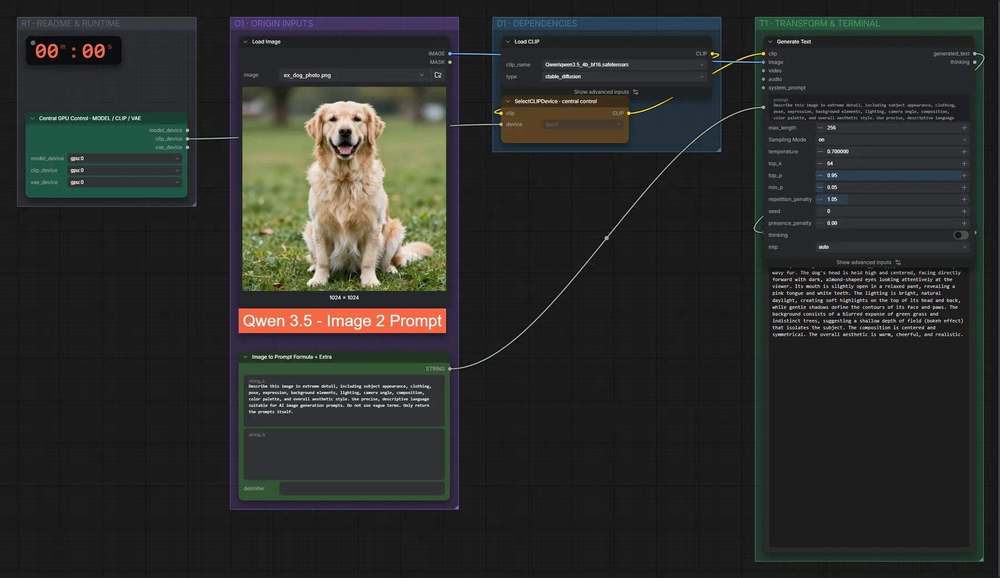

# Qwen3.5 4B (BF16) · Bild → Prompt

**Workflow-Datei:** [`workflows/Prompt Enhancer/LLM_Qwen3_5_4B_BF16-Image-to-Prompt.json`](../../../workflows/Prompt%20Enhancer/LLM_Qwen3_5_4B_BF16-Image-to-Prompt.json)  
**Kategorie:** Prompt Enhancer · **Eingabe → Ausgabe:** Bild → Prompt · **Quant:** BF16

Bis v1.3.0 hieß der Workflow `LLM_Qwen3_5_4B-Image-to-Prompt.json`.

Sehr ausführliche Bildbeschreibung als Prompt.

Interaktiv mit Zoom, Vergleichen und Kopier-Buttons: <https://dawasteh.github.io/DaWastehs-ComfyUI-Bundle/#/w/llm-qwen3-5-4b-bf16-image-to-prompt>

## Modelle

| Rolle | Datei | Quant | Größe |
|---|---|---|---:|
| Text-Encoder / LLM | `qwen3.5_4b_bf16.safetensors` | BF16 | 8,7 GiB |

## Workflow in ComfyUI

Screenshot nach dem Hauptbeispiel (Eingaben und Ergebnis im Workflow, Erklärungstafeln ausgeblendet):

[](workflow.webp)

## Beispiele

### Bild → Prompt

| Einstellung | Wert |
|---|---|
| Dauer (Ausführung) | 26 s |
| VRAM R9700 (belegt / PyTorch-Spitze) | 11,6 GiB / 9,2 GiB |
| RAM (ComfyUI-Prozess) | 9,8 GiB |

Eingabe · ex_dog_photo.png:  ([Datei](input_ex_dog_photo.webp))  

PixaromaShowText:

```text
A medium close-up, eye-level shot of a golden retriever sitting upright on a vibrant green lawn. The dog has a thick, luxurious coat of golden-yellow fur with lighter cream highlights on the chest, muzzle, and legs. Its ears are long, floppy, and covered in soft, wavy fur. The dog's head is held high and centered, facing directly forward with dark, almond-shaped eyes looking attentively at the viewer. Its mouth is slightly open in a relaxed pant, revealing a pink tongue and white teeth. The lighting is bright, natural daylight, creating soft highlights on the top of its head and back, while gentle shadows define the contours of its face and paws. The background consists of a blurred expanse of green grass and indistinct trees, suggesting a shallow depth of field (bokeh effect) that isolates the subject. The composition is centered and symmetrical. The overall aesthetic is warm, cheerful, and realistic.
```
