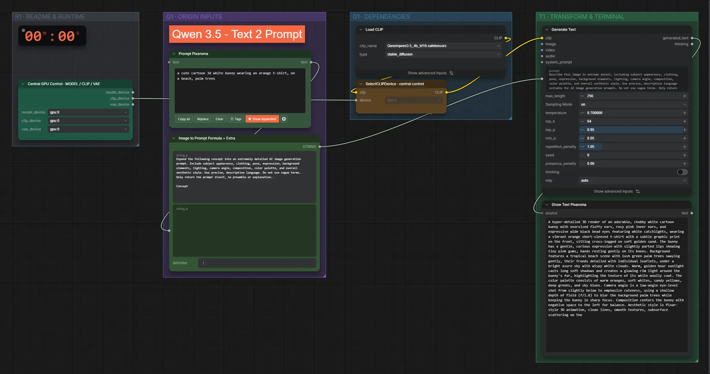

# Qwen3.5 4B (BF16) · Idee → Prompt

**Workflow-Datei:** [`workflows/Prompt Enhancer/LLM_Qwen3_5_4B_BF16-Text-to-Prompt.json`](../../../workflows/Prompt%20Enhancer/LLM_Qwen3_5_4B_BF16-Text-to-Prompt.json)  
**Kategorie:** Prompt Enhancer · **Eingabe → Ausgabe:** Text → Prompt · **Quant:** BF16

Bis v1.3.0 hieß der Workflow `LLM_Qwen3_5_4B-Text-to-Prompt.json`.

Kurze Idee → detaillierter Prompt.

Interaktiv mit Zoom, Vergleichen und Kopier-Buttons: <https://dawasteh.github.io/DaWastehs-ComfyUI-Bundle/#/w/llm-qwen3-5-4b-bf16-text-to-prompt>

## Modelle

| Rolle | Datei | Quant | Größe |
|---|---|---|---:|
| Text-Encoder / LLM | `qwen3.5_4b_bf16.safetensors` | BF16 | 8,7 GiB |

## Workflow in ComfyUI

Screenshot nach dem Hauptbeispiel (Eingaben und Ergebnis im Workflow, Erklärungstafeln ausgeblendet):

[](workflow.webp)

## Beispiele

### Idee → Prompt

Prompt:

```text
a cute cartoon 3d white bunny wearing an orange t-shirt, on a beach, palm trees
```

| Einstellung | Wert |
|---|---|
| Dauer (Ausführung) | 16 s |
| VRAM R9700 (belegt / PyTorch-Spitze) | 11,5 GiB / 9,1 GiB |
| RAM (ComfyUI-Prozess) | 10,0 GiB |


PixaromaShowText:

```text
A hyper-detailed 3D render of an adorable, chubby white cartoon bunny with oversized fluffy ears, rosy pink inner ears, and expressive wide black bead eyes featuring white catchlights, wearing a vibrant orange short-sleeved t-shirt with a subtle graphic print on the front, sitting cross-legged on soft golden sand. The bunny has a gentle, curious expression with slightly parted lips showing tiny pink gums, hands resting gently on its knees. Background features a tropical beach scene with lush green palm trees swaying gently, their fronds detailed with individual leaflets, under a bright azure sky with wispy white clouds. Warm, golden hour sunlight casts long soft shadows and creates a glowing rim light around the bunny's fur, highlighting the texture of its white woolly coat. The color palette consists of warm oranges, soft whites, sandy yellows, deep greens, and sky blues. Camera angle is a low-angle eye-level shot from slightly below to emphasize cuteness, using a shallow depth of field (f/1.8) to blur the background palm trees while keeping the bunny in sharp focus. Composition centers the bunny with negative space to the left for balance. Aesthetic style is Pixar-style 3D animation, clean lines, smooth textures, subsurface scattering on the
```

### Idee → Prompt

Prompt:

```text
an ancient underground library lit by floating lanterns
```

| Einstellung | Wert |
|---|---|
| Dauer (Ausführung) | 4 s |
| VRAM R9700 (belegt / PyTorch-Spitze) | 11,5 GiB / 9,1 GiB |
| RAM (ComfyUI-Prozess) | 1,4 GiB |


PixaromaShowText:

```text
A hyper-realistic, cinematic wide-angle shot of a colossal ancient underground library carved directly into the bedrock of a subterranean cavern, featuring towering obsidian bookshelves stretching infinitely into darkness, filled with leather-bound tomes, scrolls, and crystalline artifacts that glow with faint bioluminescence. The scene is illuminated by dozens of translucent, glowing lanterns made of polished amber glass and carved bone, suspended at varying heights by intricate chains of iron and silver, casting warm, golden-orange pools of light that contrast sharply with the cool, deep indigo shadows of the stone walls. Dust motes dance in the beams of light, creating volumetric god rays that illuminate floating geometric runes and ancient symbols etched onto the ceiling. In the foreground, a solitary figure, an elderly archivist with weathered skin, deep-set eyes, and wild white hair, wears a tattered but meticulously patched robe of indigo velvet lined with silver thread, layered over a heavy woolen cloak embroidered with constellations, standing with one hand resting on a massive open tome and the other holding a lantern, their expression one of profound reverence and quiet contemplation. The camera angle is low, looking slightly upward to emphasize the scale and grandeur of the architecture, with a shallow depth
```
