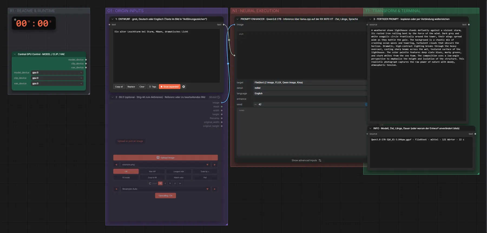

# Qwen3.8 27B (IQ4_XS) · Entwurf → fertiger Bild-Prompt

**Workflow-Datei:** [`workflows/Prompt Enhancer/LLM_Qwen3_8_27B_IQ4_XS-Draft-to-Image-Prompt.json`](../../../workflows/Prompt%20Enhancer/LLM_Qwen3_8_27B_IQ4_XS-Draft-to-Image-Prompt.json)  
**Kategorie:** Prompt Enhancer · **Eingabe → Ausgabe:** Text → Prompt · **Quant:** GGUF IQ4_XS

Bis v1.3.0 hieß der Workflow `LLM_Qwen3_8_27B-Image-Prompt-Enhancer.json`.

Grober Entwurf (Deutsch oder Englisch) → ausformulierter Prompt für Fließtext-, Schrift-, Tag- oder Edit-Modelle; läuft über llama.cpp auf der RX 9070 XT.

Interaktiv mit Zoom, Vergleichen und Kopier-Buttons: <https://dawasteh.github.io/DaWastehs-ComfyUI-Bundle/#/w/llm-qwen3-8-27b-iq4-xs-draft-to-image-prompt>

## Workflow in ComfyUI

Screenshot nach dem Hauptbeispiel (Eingaben und Ergebnis im Workflow, Erklärungstafeln ausgeblendet):

[](workflow.webp)

## Beispiele

### Fließtext · Leuchtturm im Sturm

Prompt:

```text
Ein alter Leuchtturm bei Sturm, Möwen, dramatisches Licht
```

| Einstellung | Wert |
|---|---|
| target | Fließtext (Z-Image, FLUX, Qwen Image, Krea) |
| detail | mittel |
| language | English |
| seed | 42 |
| Dauer (Ausführung) | 22 s |
| VRAM R9700 (belegt / PyTorch-Spitze) | 5,0 GiB / 0,1 GiB |
| VRAM llama-server (RX 9070 XT) | 12,6 GiB |
| RAM (ComfyUI-Prozess) | 14,5 GiB |


3 · FERTIGER PROMPT · kopieren oder per Verbindung weiterreichen:

```text
A weathered stone lighthouse stands defiantly against a violent storm, its rusted iron railing bent by the force of the wind. Dark grey and white seagulls circle frantically around the tower, their wings spread wide as they battle the gale. The background is a chaotic mix of crashing ocean waves and towering, turbulent clouds that obscure the horizon. Dramatic, high-contrast lighting breaks through the heavy overcast, casting sharp beams across the wet, textured surface of the lighthouse. The color palette features deep slate blues, murky greens, and stark whites from the sea foam. The composition uses a low-angle perspective to emphasize the height and isolation of the structure. This realistic photograph captures the raw power of nature with moody, atmospheric tension.
```

INFO · Modell, Ziel, Länge, Dauer (oder warum der Entwurf unverändert blieb):

```text
Qwen3.8-27B-IQ4_XS-3.84bpw.gguf · Fließtext · mittel · 121 Wörter · 22 s
```

### Text im Bild · Konzertplakat

Prompt:

```text
Plakat für ein Jazzkonzert "BLUE NOTES" am 12. Oktober im Hafen
```

| Einstellung | Wert |
|---|---|
| target | Text im Bild (Poster, Logo, Schild) |
| detail | mittel |
| language | English |
| seed | 42 |
| Dauer (Ausführung) | 20 s |
| VRAM R9700 (belegt / PyTorch-Spitze) | 5,0 GiB / 0,1 GiB |
| VRAM llama-server (RX 9070 XT) | 12,6 GiB |
| RAM (ComfyUI-Prozess) | 14,5 GiB |


3 · FERTIGER PROMPT · kopieren oder per Verbindung weiterreichen:

```text
Poster for a jazz concert, vertical A3 format with a bold, rhythmic layout. The background is a deep midnight blue gradient fading into black, evoking a moody, atmospheric night scene. The mood is sophisticated and musical, with subtle grain texture. At the top center, the word "BLUE" appears in large, bold, sans-serif capital letters in bright cyan, slightly tilted for dynamic energy. Directly below it, the word "NOTES" is rendered in an even larger, heavy serif typeface in warm gold, dominating the central composition. Beneath the main title, the date "12. Oktober" is written in a smaller, elegant italic script in white, centered horizontally. At the very bottom center, the location "im Hafen" appears in small, clean sans-serif capital letters in light grey. A thin, wavy gold line separates the date from the location, resembling a sound wave. Faint, translucent smoke swirls drift behind the typography, adding depth without obscuring the text. The entire design is rendered as a flat vector illustration with crisp edges and high contrast, suitable for screen print production.
```

INFO · Modell, Ziel, Länge, Dauer (oder warum der Entwurf unverändert blieb):

```text
Qwen3.8-27B-IQ4_XS-3.84bpw.gguf · Text im Bild · mittel · 173 Wörter · 20 s
```

### Tags · Anime-Szene

Prompt:

```text
Mädchen mit Katzenohren sitzt im Regen an einer Bushaltestelle
```

| Einstellung | Wert |
|---|---|
| target | Tags (SDXL, Pony, Illustrious) |
| detail | mittel |
| language | English |
| seed | 42 |
| Dauer (Ausführung) | 14 s |
| VRAM R9700 (belegt / PyTorch-Spitze) | 5,0 GiB / 0,1 GiB |
| VRAM llama-server (RX 9070 XT) | 12,6 GiB |
| RAM (ComfyUI-Prozess) | 14,3 GiB |


3 · FERTIGER PROMPT · kopieren oder per Verbindung weiterreichen:

```text
masterpiece, best quality, highly detailed, 1girl, solo, cat ears, sitting, bus stop, rain, wet clothes, puddles, street lamp, night, blue lighting, melancholic, cinematic, depth of field, anime style
```

INFO · Modell, Ziel, Länge, Dauer (oder warum der Entwurf unverändert blieb):

```text
Qwen3.8-27B-IQ4_XS-3.84bpw.gguf · Tags · mittel · 18 Tags · 14 s
```

### Fließtext · kurz auf Deutsch

Prompt:

```text
Katze schläft auf einem Stapel alter Bücher
```

| Einstellung | Wert |
|---|---|
| target | Fließtext (Z-Image, FLUX, Qwen Image, Krea) |
| detail | kurz |
| language | Deutsch |
| seed | 42 |
| Dauer (Ausführung) | 15 s |
| VRAM R9700 (belegt / PyTorch-Spitze) | 5,0 GiB / 0,1 GiB |
| VRAM llama-server (RX 9070 XT) | 12,6 GiB |
| RAM (ComfyUI-Prozess) | 14,5 GiB |


3 · FERTIGER PROMPT · kopieren oder per Verbindung weiterreichen:

```text
Eine entspannte Katze liegt zusammengerollt und schläft auf einem hohen Stapel alter, gebundener Bücher. Das Fell ist glatt und weich, die Augen sind geschlossen. Die Bücher zeigen abgenutzte Ledereinbände und vergilbtes Papier. Der Hintergrund ist ein ruhiges Bibliothekszimmer mit warmem Licht. Die Szene wirkt friedlich und nostalgisch.
```

INFO · Modell, Ziel, Länge, Dauer (oder warum der Entwurf unverändert blieb):

```text
Qwen3.8-27B-IQ4_XS-3.84bpw.gguf · Fließtext · kurz · 47 Wörter · 15 s
```

### Bearbeiten · mit Bild

Prompt:

```text
gib ihr eine rote Lederjacke und lass sie lächeln
```

| Einstellung | Wert |
|---|---|
| target | Bearbeiten (Anweisung für Edit-Modelle) |
| detail | mittel |
| language | English |
| seed | 42 |
| Dauer (Ausführung) | 19 s |
| VRAM R9700 (belegt / PyTorch-Spitze) | 5,0 GiB / 0,1 GiB |
| VRAM llama-server (RX 9070 XT) | 12,6 GiB |
| RAM (ComfyUI-Prozess) | 14,6 GiB |

Bild-Loader eingeschaltet (Strg+M), damit Qwen das zu bearbeitende Bild sieht.

Eingabe · ex_portrait_woman.png:  ([Datei](input_ex_portrait_woman.webp))  

3 · FERTIGER PROMPT · kopieren oder per Verbindung weiterreichen:

```text
Replace the dark green knit sweater with a fitted red leather jacket and keep the face, pose and background exactly as they are.
```

INFO · Modell, Ziel, Länge, Dauer (oder warum der Entwurf unverändert blieb):

```text
Qwen3.8-27B-IQ4_XS-3.84bpw.gguf · Bearbeiten · mittel · 23 Wörter · 19 s
```
