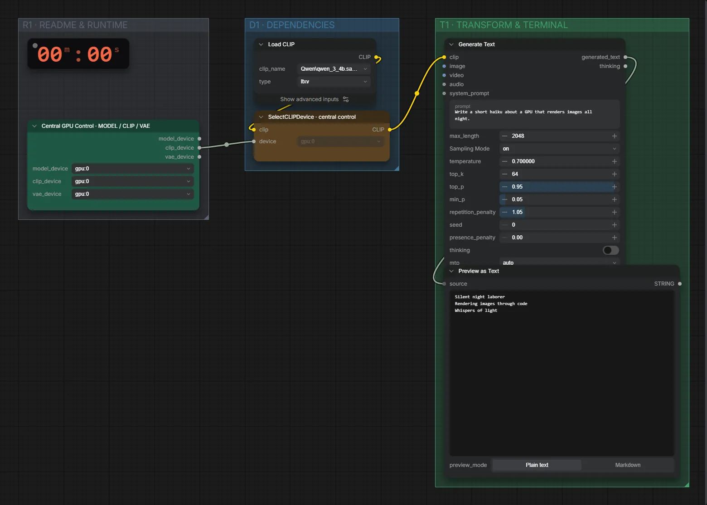

# Qwen3 4B (BF16) · Text → Text

**Workflow-Datei:** [`workflows/Prompt Tools/LLM_Qwen3_4B_BF16-Text-to-Text.json`](../../../workflows/Prompt%20Tools/LLM_Qwen3_4B_BF16-Text-to-Text.json)  
**Kategorie:** Prompt Tools · **Eingabe → Ausgabe:** Text → Text · **Quant:** BF16

Bis v1.3.0 hieß der Workflow `LLM_Qwen3_4B-Text-Generation.json`.

Einfache Textgenerierung mit Qwen3 4B.

Interaktiv mit Zoom, Vergleichen und Kopier-Buttons: <https://dawasteh.github.io/DaWastehs-ComfyUI-Bundle/#/w/llm-qwen3-4b-bf16-text-to-text>

## Modelle

| Rolle | Datei | Quant | Größe |
|---|---|---|---:|
| Text-Encoder / LLM | `qwen_3_4b.safetensors` | BF16 | 7,5 GiB |

## Workflow in ComfyUI

Screenshot nach dem Hauptbeispiel (Eingaben und Ergebnis im Workflow, Erklärungstafeln ausgeblendet):

[](workflow.webp)

## Beispiele

### Text → Text

Prompt:

```text
Write a short haiku about a GPU that renders images all night.
```

| Einstellung | Wert |
|---|---|
| Dauer (Ausführung) | 50 s |
| VRAM R9700 (belegt / PyTorch-Spitze) | 12,8 GiB / 8,0 GiB |
| RAM (ComfyUI-Prozess) | 8,4 GiB |


PreviewAny:

```text
Silent night laborer  
Rendering images through code  
Whispers of light
```
