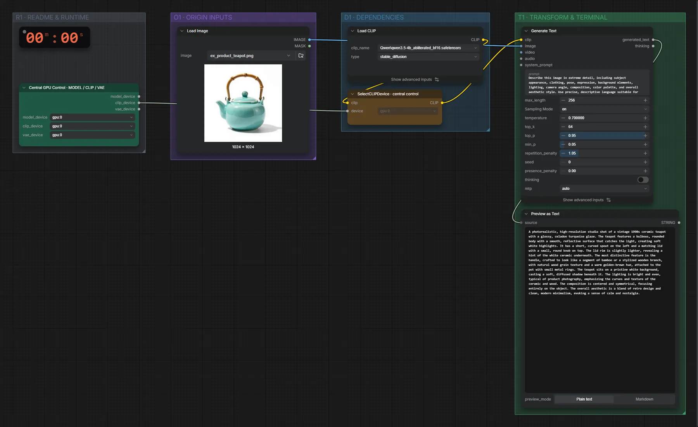

# Qwen3.5 4B abliterated (BF16) · Bild → Beschreibung

**Workflow-Datei:** [`workflows/Prompt Tools/LLM_Qwen3_5_4B_Abliterated_BF16-Image-to-Text.json`](../../../workflows/Prompt%20Tools/LLM_Qwen3_5_4B_Abliterated_BF16-Image-to-Text.json)  
**Kategorie:** Prompt Tools · **Eingabe → Ausgabe:** Bild → Text · **Quant:** BF16

Bis v1.3.0 hieß der Workflow `LLM_Qwen3_5_4B_abliterated-Text-Generation.json`.

Bildbeschreibung mit der abliterated Qwen3.5-Variante (der alte Name sagte Text-Generierung, es ist Bild → Text).

Interaktiv mit Zoom, Vergleichen und Kopier-Buttons: <https://dawasteh.github.io/DaWastehs-ComfyUI-Bundle/#/w/llm-qwen3-5-4b-abliterated-bf16-image-to-text>

## Modelle

| Rolle | Datei | Quant | Größe |
|---|---|---|---:|
| Text-Encoder / LLM | `qwen3.5-4b_abliterated_bf16.safetensors` | BF16 | 8,5 GiB |

## Workflow in ComfyUI

Screenshot nach dem Hauptbeispiel (Eingaben und Ergebnis im Workflow, Erklärungstafeln ausgeblendet):

[](workflow.webp)

## Beispiele

### Bild → Beschreibung

| Einstellung | Wert |
|---|---|
| Dauer (Ausführung) | 26 s |
| VRAM R9700 (belegt / PyTorch-Spitze) | 11,0 GiB / 9,0 GiB |
| RAM (ComfyUI-Prozess) | 9,3 GiB |

Eingabe · ex_product_teapot.png:  ([Datei](input_ex_product_teapot.webp))  

PreviewAny:

```text
A photorealistic, high-resolution studio shot of a vintage 1990s ceramic teapot with a glossy, celadon turquoise glaze. The teapot features a bulbous, rounded body with a smooth, reflective surface that catches the light, creating soft white highlights. It has a short, curved spout on the left and a matching lid with a small, round knob on top. The lid rim is slightly lighter, revealing a hint of the white ceramic underneath. The most distinctive feature is the handle, crafted to look like a segment of bamboo or a stylized wooden branch, with natural wood grain texture and a warm golden-brown hue, attached to the pot with small metal rings. The teapot sits on a pristine white background, casting a soft, diffused shadow beneath it. The lighting is bright and even, typical of product photography, emphasizing the curves and texture of the ceramic and wood. The composition is centered and symmetrical, focusing entirely on the object. The overall aesthetic is a blend of retro design and clean, modern minimalism, evoking a sense of calm and nostalgia.
```
