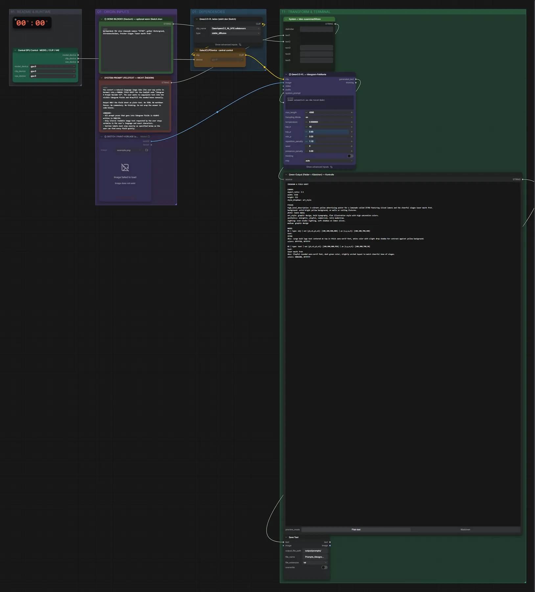

# Qwen3.5 4B · Idee → Ideogram-Felder

**Workflow-Datei:** [`workflows/Prompt Tools/LLM_Qwen3_5_4B_BF16-Idea-to-Ideogram4-Fields.json`](../../../workflows/Prompt%20Tools/LLM_Qwen3_5_4B_BF16-Idea-to-Ideogram4-Fields.json)  
**Kategorie:** Prompt Tools · **Eingabe → Ausgabe:** Text → Prompt · **Quant:** BF16

Bis v1.3.0 hieß der Workflow `Ideogram4_Qwen3_5-Field-Text-Builder.json`.

Füllt die Felder des Ideogram-Prompt-Builders aus einer Idee (optional mit Skizze).

Interaktiv mit Zoom, Vergleichen und Kopier-Buttons: <https://dawasteh.github.io/DaWastehs-ComfyUI-Bundle/#/w/llm-qwen3-5-4b-bf16-idea-to-ideogram4-fields>

## Modelle

| Rolle | Datei | Quant | Größe |
|---|---|---|---:|
| Text-Encoder / LLM | `qwen3.5_4b_bf16.safetensors` | BF16 | 8,7 GiB |

## Workflow in ComfyUI

Screenshot nach dem Hauptbeispiel (Eingaben und Ergebnis im Workflow, Erklärungstafeln ausgeblendet):

[](workflow.webp)

## Beispiele

### Idee → Ideogram-Felder

Prompt:

```text
Werbeplakat für eine Limonade namens "ZITRO": gelber Hintergrund, Zitronenscheiben, frecher Slogan "Sauer macht froh"
```

| Einstellung | Wert |
|---|---|
| Dauer (Ausführung) | 18 s |
| VRAM R9700 (belegt / PyTorch-Spitze) | 12,1 GiB / 9,6 GiB |
| VRAM RX 9070 XT (belegt / PyTorch-Spitze) | 0,7 GiB / 0,1 GiB |
| RAM (ComfyUI-Prozess) | 13,9 GiB |


Qwen-Output (Felder + Kästchen) — Kontrolle:

```text
IDEOGRAM 4 FIELD SHEET

CANVAS
aspect_ratio: 3:1
width: 1536
height: 512
style_dropdown: art_style

FIELDS
high_level_description: A vibrant yellow advertising poster for a lemonade called ZITRO featuring sliced lemons and the cheerful slogan Sauer macht froh.
background: solid bright yellow background, no walls or ceiling fixtures.
photo: leave empty
art_style: graphic design, bold typography, flat illustration style with high saturation colors.
aesthetics: energetic, playful, commercial, retro modernism.
lighting: even studio lighting, soft shadows on lemon slices.
medium: graphic design

BOXES
01 | type: obj | out [y1,x1,y2,x2]: [100,100,900,800] | px [x,y,w,h]: [100,100,700,400]
text:
ZITRO
desc: Large bold logo text centered at top in thick sans-serif font, white color with slight drop shadow for contrast against yellow background.
colors: #FFFFE0, #FFFFFF

02 | type: text | out [y1,x1,y2,x2]: [100,900,800,950] | px [x,y,w,h]: [100,900,700,50]
text:
Sauer macht froh
desc: Playful rounded sans-serif font, dark green color, slightly arched layout to match cheerful tone of slogan.
colors: #006400, #FFFFFF
```
