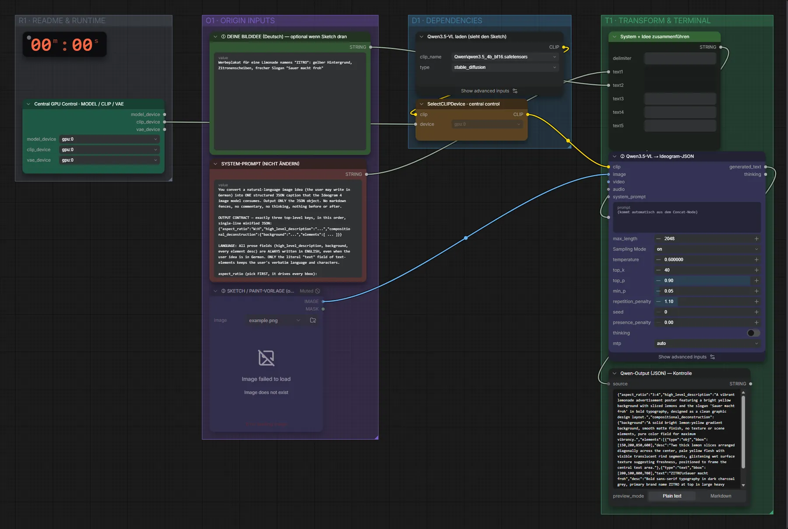

# Qwen3.5 4B · Idee → Ideogram-JSON

**Workflow-Datei:** [`workflows/Prompt Tools/LLM_Qwen3_5_4B_BF16-Idea-to-Ideogram4-JSON.json`](../../../workflows/Prompt%20Tools/LLM_Qwen3_5_4B_BF16-Idea-to-Ideogram4-JSON.json)  
**Kategorie:** Prompt Tools · **Eingabe → Ausgabe:** Text → Prompt · **Quant:** BF16

Bis v1.3.0 hieß der Workflow `Ideogram4_Qwen3_5-JSON-Prompt-Builder.json`.

Erzeugt das komplette Ideogram-4-JSON aus einer Idee.

Interaktiv mit Zoom, Vergleichen und Kopier-Buttons: <https://dawasteh.github.io/DaWastehs-ComfyUI-Bundle/#/w/llm-qwen3-5-4b-bf16-idea-to-ideogram4-json>

## Modelle

| Rolle | Datei | Quant | Größe |
|---|---|---|---:|
| Text-Encoder / LLM | `qwen3.5_4b_bf16.safetensors` | BF16 | 8,7 GiB |

## Workflow in ComfyUI

Screenshot nach dem Hauptbeispiel (Eingaben und Ergebnis im Workflow, Erklärungstafeln ausgeblendet):

[](workflow.webp)

## Beispiele

### Idee → Ideogram-Felder

Prompt:

```text
Werbeplakat für eine Limonade namens "ZITRO": gelber Hintergrund, Zitronenscheiben, frecher Slogan "Sauer macht froh"
```

| Einstellung | Wert |
|---|---|
| Dauer (Ausführung) | 9 s |
| VRAM R9700 (belegt / PyTorch-Spitze) | 10,6 GiB / 9,4 GiB |
| RAM (ComfyUI-Prozess) | 9,1 GiB |


Qwen-Output (JSON) — Kontrolle:

```text
{"aspect_ratio":"3:4","high_level_description":"A vibrant lemonade advertisement poster featuring a bright yellow background with sliced lemons and the slogan 'Sauer macht froh' in bold typography, designed as a clean graphic design layout.","compositional_deconstruction":{"background":"A solid bright lemon-yellow gradient background, smooth matte finish, no texture or scene elements, pure color field for maximum vibrancy.","elements":[{"type":"obj","bbox":[150,200,850,600],"desc":"Two thick lemon slices arranged diagonally across the center, pale yellow flesh with visible translucent rind segments, glistening wet surface texture suggesting freshness, positioned to frame the central text area."},{"type":"text","bbox":[200,100,800,700],"text":"ZITRO\nSauer macht froh","desc":"Bold sans-serif typography in dark charcoal grey, primary brand name ZITRO at top in large heavy weight, secondary slogan Sauer macht froh below in medium weight, centered alignment, high contrast against yellow background."}]},"medium":"graphic design"}
```
