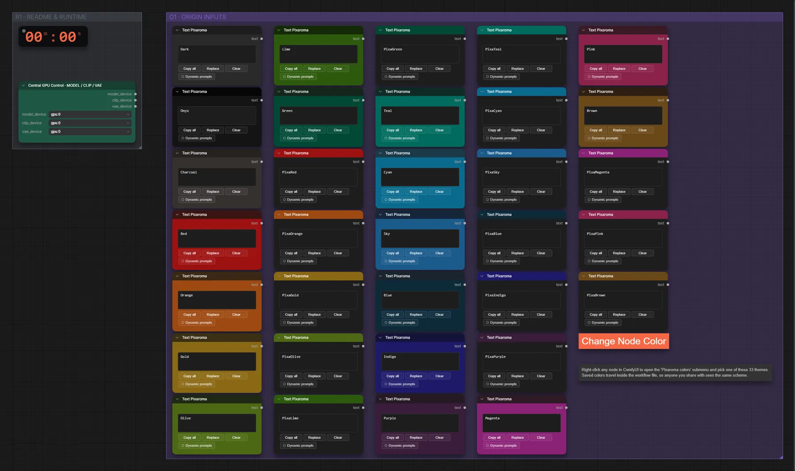

# Pixaroma · Knotenfarben

**Workflow-Datei:** [`workflows/Prompt Tools/Pixaroma-Change-Node-Color.json`](../../../workflows/Prompt%20Tools/Pixaroma-Change-Node-Color.json)  
**Kategorie:** Prompt Tools · **Eingabe → Ausgabe:** – → –

Zeigt alle Pixaroma-Farbvorgaben für Knoten.

Interaktiv mit Zoom, Vergleichen und Kopier-Buttons: <https://dawasteh.github.io/DaWastehs-ComfyUI-Bundle/#/w/pixaroma-change-node-color>

> Kein Beispiel-Lauf: Die Demo zeigt eine Canvas-Funktion ohne Ausgabe-Node, ComfyUI führt sie nicht aus.

## Workflow in ComfyUI

Screenshot nach dem Hauptbeispiel (Eingaben und Ergebnis im Workflow, Erklärungstafeln ausgeblendet):

