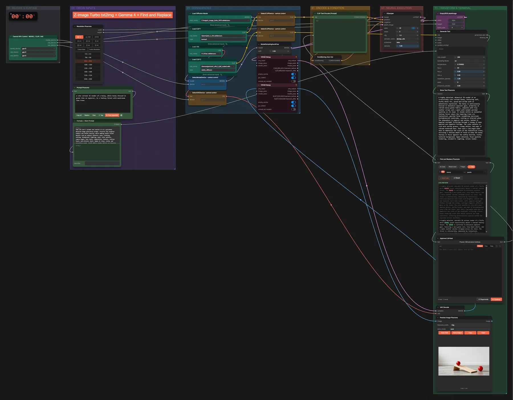
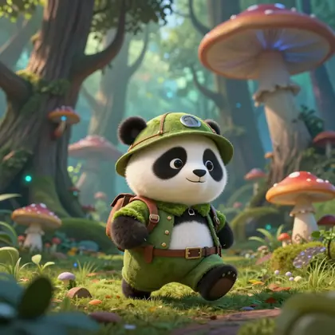

# Pixaroma · Suchen/Ersetzen + Z-Image

**Workflow-Datei:** [`workflows/Prompt Tools/Pixaroma-Find-and-Replace+ZImage.json`](../../../workflows/Prompt%20Tools/Pixaroma-Find-and-Replace%2BZImage.json)  
**Kategorie:** Prompt Tools · **Eingabe → Ausgabe:** Text → Bild

Ein LLM schreibt einen Prompt, Suchen/Ersetzen erzeugt Varianten, Z-Image Turbo malt sie.

Interaktiv mit Zoom, Vergleichen und Kopier-Buttons: <https://dawasteh.github.io/DaWastehs-ComfyUI-Bundle/#/w/pixaroma-find-and-replace-zimage>

## Modelle

| Rolle | Datei | Quant | Größe |
|---|---|---|---:|
| Diffusionsmodell | `z_image_turbo_bf16.safetensors` | BF16 | 11,5 GiB |
| VAE | `ae.safetensors` | FP32 | 0,3 GiB |
| Text-Encoder / LLM | `qwen_3_4b.safetensors` | BF16 | 7,5 GiB |
| Text-Encoder / LLM | `gemma4_e4b_it_fp8_scaled.safetensors` | FP8 | 8,4 GiB |

## Workflow in ComfyUI

Screenshot nach dem Hauptbeispiel (Eingaben und Ergebnis im Workflow, Erklärungstafeln ausgeblendet):

[](workflow.webp)

## Beispiele

### Prompt-Varianten per Suchen/Ersetzen

| Einstellung | Wert |
|---|---|
| seed | 42 |
| steps | 5 |
| cfg | 1 |
| sampler_name | dpmpp_sde |
| scheduler | beta |
| denoise | 1 |
| shift | 3 |
| Dauer (Ausführung) | 57 s |
| VRAM R9700 (belegt / PyTorch-Spitze) | 29,8 GiB / 24,7 GiB |
| RAM (ComfyUI-Prozess) | 32,5 GiB |

Der LLM-Text wird am Pause-Knoten unverändert übernommen („Continue“).

Ausgabe · Ausgabe: [](bunny.webp) · [Volle Auflösung (1024×1024, WebP mit Workflow – per Drag & Drop in ComfyUI ladbar)](bunny.webp)  

PixaromaShowText:

```text
A highly detailed, whimsical 3D render of an irresistibly cute cartoon bunny, featuring soft, fluffy white fur, posed mid-stride with an adventurous expression. The bunny is meticulously dressed in miniature explorer gear, primarily in vibrant mossy green fabric, complete with tiny leather straps and a small pith helmet perched jauntily on its head. It stands within an enchanted fantasy forest where the towering trees are fantastical, gnarled forms resembling oversized, bioluminescent mushrooms, casting an ethereal glow. The atmosphere is magical and serene, bathed in dappled sunlight filtering through a canopy of deep emerald and sapphire foliage. The color palette is rich with earthy greens, creamy whites, and pops of vibrant mushroom hues. Shot with a low-angle wide-shot to emphasize the scale of the fantastical trees, utilizing a shallow depth of field to keep the bunny sharply in focus against the softly blurred, richly textured background. Hyper-detailed, Pixar-quality rendering, volumetric lighting, octane render.
```
