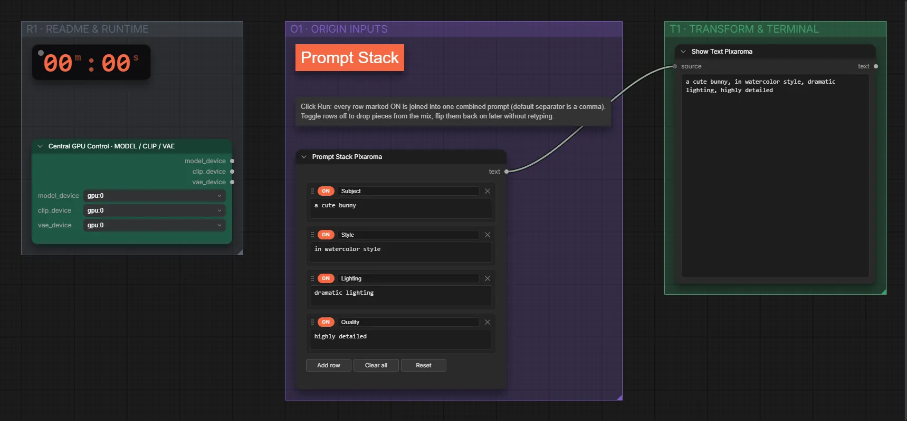

# Pixaroma · Prompt-Stapel

**Workflow-Datei:** [`workflows/Prompt Tools/Pixaroma-Prompt-Stack.json`](../../../workflows/Prompt%20Tools/Pixaroma-Prompt-Stack.json)  
**Kategorie:** Prompt Tools · **Eingabe → Ausgabe:** Text → Text

Prompt-Teile stapeln und kombinieren.

Interaktiv mit Zoom, Vergleichen und Kopier-Buttons: <https://dawasteh.github.io/DaWastehs-ComfyUI-Bundle/#/w/pixaroma-prompt-stack>

## Workflow in ComfyUI

Screenshot nach dem Hauptbeispiel (Eingaben und Ergebnis im Workflow, Erklärungstafeln ausgeblendet):

[](workflow.webp)

## Beispiele

### Mitgelieferte Demo

| Einstellung | Wert |
|---|---|
| Dauer (Ausführung) | 14 s |
| RAM (ComfyUI-Prozess) | 1,3 GiB |

Unverändert – die Demo-Daten stecken im Workflow.


PixaromaShowText:

```text
a cute bunny, in watercolor style, dramatic lighting, highly detailed
```
