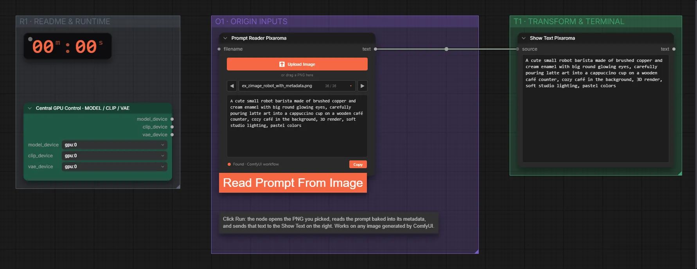

# Pixaroma · Prompt aus PNG lesen

**Workflow-Datei:** [`workflows/Prompt Tools/Pixaroma-Read-Prompt-From-Image.json`](../../../workflows/Prompt%20Tools/Pixaroma-Read-Prompt-From-Image.json)  
**Kategorie:** Prompt Tools · **Eingabe → Ausgabe:** Bild → Text

Liest Prompt und Einstellungen aus einem ComfyUI-PNG.

Interaktiv mit Zoom, Vergleichen und Kopier-Buttons: <https://dawasteh.github.io/DaWastehs-ComfyUI-Bundle/#/w/pixaroma-read-prompt-from-image>

## Workflow in ComfyUI

Screenshot nach dem Hauptbeispiel (Eingaben und Ergebnis im Workflow, Erklärungstafeln ausgeblendet):

[](workflow.webp)

## Beispiele

### Prompt aus PNG lesen

| Einstellung | Wert |
|---|---|
| Dauer (Ausführung) | 10 s |
| VRAM R9700 (belegt / PyTorch-Spitze) | 5,1 GiB / 0,1 GiB |
| RAM (ComfyUI-Prozess) | 1,3 GiB |

Eingabe · PNG aus dem Z-Image-Turbo-Beispiel (mit Workflow-Metadaten):  ([Datei](input_ex_zimage_robot_with_metadata.webp))  

PixaromaPromptReader:

```text
A cute small robot barista made of brushed copper and cream enamel with big round glowing eyes, carefully pouring latte art into a cappuccino cup on a wooden café counter, cozy café in the background, 3D render, soft studio lighting, pastel colors
```

PixaromaShowText:

```text
A cute small robot barista made of brushed copper and cream enamel with big round glowing eyes, carefully pouring latte art into a cappuccino cup on a wooden café counter, cozy café in the background, 3D render, soft studio lighting, pastel colors
```
