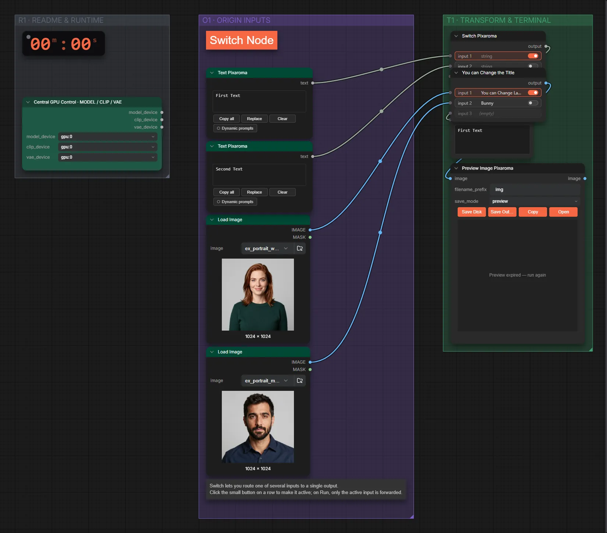

# Pixaroma · Wert umschalten

**Workflow-Datei:** [`workflows/Prompt Tools/Pixaroma-Switch-Value.json`](../../../workflows/Prompt%20Tools/Pixaroma-Switch-Value.json)  
**Kategorie:** Prompt Tools · **Eingabe → Ausgabe:** Bild + Text → Bild + Text

Zwischen zwei Eingaben (Bild oder Text) umschalten.

Interaktiv mit Zoom, Vergleichen und Kopier-Buttons: <https://dawasteh.github.io/DaWastehs-ComfyUI-Bundle/#/w/pixaroma-switch-value>

## Workflow in ComfyUI

Screenshot nach dem Hauptbeispiel (Eingaben und Ergebnis im Workflow, Erklärungstafeln ausgeblendet):

[](workflow.webp)

## Beispiele

### Wert umschalten

| Einstellung | Wert |
|---|---|
| Dauer (Ausführung) | 0 s |
| VRAM R9700 (belegt / PyTorch-Spitze) | 4,7 GiB / 0,1 GiB |
| RAM (ComfyUI-Prozess) | 0,8 GiB |

Eingabe · ex_portrait_woman.png:  ([Datei](input_ex_portrait_woman.webp))  
Eingabe · ex_portrait_man.png:  ([Datei](input_ex_portrait_man.webp))  
Ausgabe · Ausgabe: [](switch.webp) · [Volle Auflösung (1024×1024, WebP mit Workflow – per Drag & Drop in ComfyUI ladbar)](switch.webp)  

PixaromaShowText:

```text
First Text
```
