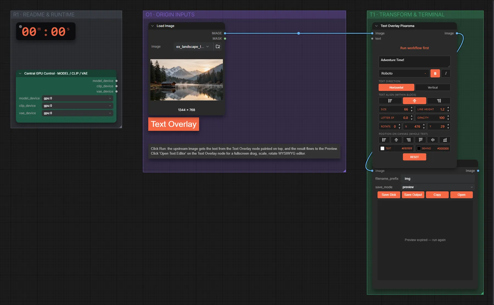

# Pixaroma · Text über Bild

**Workflow-Datei:** [`workflows/Prompt Tools/Pixaroma-Text-Overlay.json`](../../../workflows/Prompt%20Tools/Pixaroma-Text-Overlay.json)  
**Kategorie:** Prompt Tools · **Eingabe → Ausgabe:** Bild → Bild

Schriftzug über ein Bild legen.

Interaktiv mit Zoom, Vergleichen und Kopier-Buttons: <https://dawasteh.github.io/DaWastehs-ComfyUI-Bundle/#/w/pixaroma-text-overlay>

## Workflow in ComfyUI

Screenshot nach dem Hauptbeispiel (Eingaben und Ergebnis im Workflow, Erklärungstafeln ausgeblendet):

## Beispiele

### Text über ein Bild legen

| Einstellung | Wert |
|---|---|
| Dauer (Ausführung) | 0 s |
| VRAM R9700 (belegt / PyTorch-Spitze) | 4,7 GiB / 0,1 GiB |
| RAM (ComfyUI-Prozess) | 0,9 GiB |

Eingabe · ex_landscape_lake.png:  ([Datei](input_ex_landscape_lake.webp))  
Ausgabe · Bild 1:  · [Volle Auflösung (1344×768, WebP)](overlay__n2.webp)  
Ausgabe · Bild 2: 
