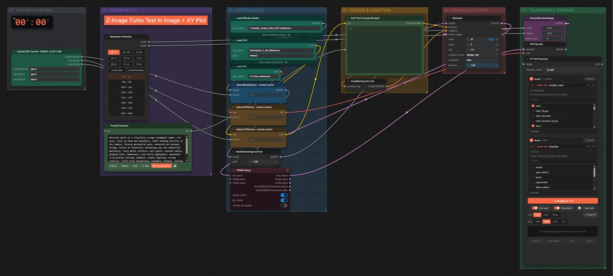
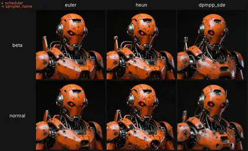

# Pixaroma · XY-Plot + Z-Image

**Workflow-Datei:** [`workflows/Prompt Tools/Pixaroma-XY-Plot+ZImage.json`](../../../workflows/Prompt%20Tools/Pixaroma-XY-Plot%2BZImage.json)  
**Kategorie:** Prompt Tools · **Eingabe → Ausgabe:** Text → Bild

Raster mit Varianten (z. B. Sampler × Schritte) zum Vergleichen.

Interaktiv mit Zoom, Vergleichen und Kopier-Buttons: <https://dawasteh.github.io/DaWastehs-ComfyUI-Bundle/#/w/pixaroma-xy-plot-zimage>

## Modelle

| Rolle | Datei | Quant | Größe |
|---|---|---|---:|
| Diffusionsmodell | `z_image_turbo_bf16.safetensors` | BF16 | 11,5 GiB |
| VAE | `ae.safetensors` | FP32 | 0,3 GiB |
| Text-Encoder / LLM | `qwen_3_4b.safetensors` | BF16 | 7,5 GiB |

## Workflow in ComfyUI

Screenshot nach dem Hauptbeispiel (Eingaben und Ergebnis im Workflow, Erklärungstafeln ausgeblendet):

## Beispiele

### XY-Plot (Sampler × Schritte)

| Einstellung | Wert |
|---|---|
| seed | 42 |
| steps | 5 |
| cfg | 1 |
| sampler_name | dpmpp_sde |
| scheduler | beta |
| denoise | 1 |
| shift | 3 |
| Dauer (Ausführung) | 2 s |
| VRAM R9700 (belegt / PyTorch-Spitze) | 22,1 GiB / 20,8 GiB |
| RAM (ComfyUI-Prozess) | 24,5 GiB |

Ausgabe · Ausgabe:  · [Volle Auflösung (1832×1118, WebP mit Workflow – per Drag & Drop in ComfyUI ladbar)](robot.webp)
