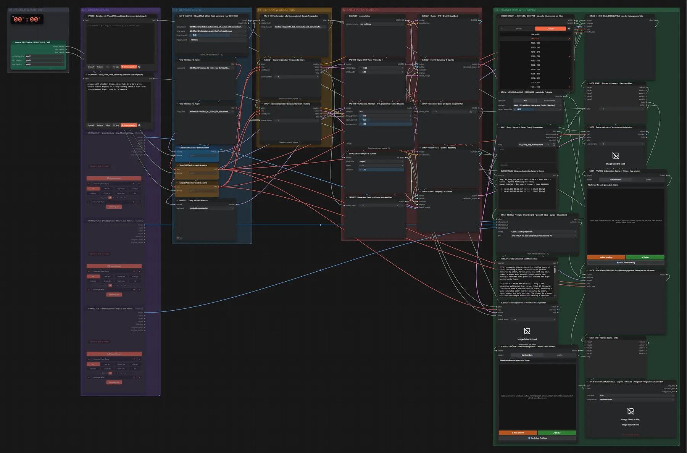

# MiniMax FastH3 · Song → Musikvideo (One-Click)

**Workflow-Datei:** [`workflows/Reference to Video/MiniMax_FastH3_INT8-Song+Lyrics-to-Music-Video.json`](../../../workflows/Reference%20to%20Video/MiniMax_FastH3_INT8-Song%2BLyrics-to-Music-Video.json)  
**Kategorie:** Reference to Video · **Eingabe → Ausgabe:** Song + Songtext + Text → Video · **Quant:** INT8

Bis v1.3.0 hieß der Workflow `MiniMax_H3_Complete_Song_to_Music_Video_One_Click.json`.

Song + Songtext + Videoidee: Szenenplan, Prompts (Qwen3.8), FastH3-Szenen mit Lippensync, Prüfung jeder Szene (Weiter/Neu rendern), optionales Upscale und fertiges Video mit Originalton.

Interaktiv mit Zoom, Vergleichen und Kopier-Buttons: <https://dawasteh.github.io/DaWastehs-ComfyUI-Bundle/#/w/minimax-fasth3-int8-song-lyrics-to-music-video>

> Gekürztes Beispiel: 8-Sekunden-Songausschnitt, zwei Szenen in 960×544, Prüf-Stationen auf „durchrendern“, ohne Upscale. Ein komplettes Musikvideo dauert Stunden und hält standardmäßig nach jeder Szene zur Freigabe an.

## Modelle

| Rolle | Datei | Quant | Größe |
|---|---|---|---:|
| Text-Encoder | `qwen3vl_32b_minimax_h3_int8_convrot.safetensors` | INT8 | 25,3 GiB |
| Diffusionsmodell | `fastvideo_fasth3_8step_v2_pruned_int8_convrot.safetensors` | INT8 | 20,6 GiB |
| Diffusionsmodell | `h3-realism-people-t2v-i2v-r2v.safetensors` | BF16 | 0,1 GiB |
| VAE | `minimax_h3_video_vae_fp16.safetensors` | FP16 | 4,8 GiB |
| VAE | `minimax_h3_audio_vae_fp32.safetensors` | FP32 | 0,6 GiB |

## Workflow in ComfyUI

Screenshot nach dem Hauptbeispiel (Eingaben und Ergebnis im Workflow, Erklärungstafeln ausgeblendet):

[](workflow.webp)

## Beispiele

### 8-s-Song → Musikvideo (2 Szenen, 960×544)

| Einstellung | Wert |
|---|---|
| video_idea | A woman with shoulder-length auburn hair in a dark green sweater dances happily on a sunny rooftop above a city, warm late-afternoon light, colorful, cinematic |
| song | 8-s-Ausschnitt (instrumental, Lyrics leer) |
| size | 960 × 544 |
| scenes | Ziel 4 s (min 3, max 5) |
| review | durchrendern |
| upscale | aus |
| sampler_name | res_multistep |
| scheduler | simple |
| steps | 8 |
| denoise | 1.0 |
| Dauer (Ausführung) | 5 min 11 s |
| VRAM R9700 (belegt / PyTorch-Spitze) | 30,3 GiB / 26,1 GiB |
| RAM (ComfyUI-Prozess) | 31,9 GiB |

Kurzes Galerie-Beispiel: 8-Sekunden-Songausschnitt in 960×544 mit zwei Szenen, Prüf-Stationen auf „durchrendern“ und ohne Upscale. Für echte Musikvideos: Prüfung jeder Szene (Standard) und Upscale.

Eingabe · ex_song_pop_excerpt.mp3: [input_ex_song_pop_excerpt.mp3](input_ex_song_pop_excerpt.mp3)  
Ausgabe · Fertiges Musikvideo (Originalton): [short__n37.mp4](short__n37.mp4)  
Ausgabe · Szene 1: [short__n25.mp4](short__n25.mp4)  
Ausgabe · Szene 2: [short__n33.mp4](short__n33.mp4)  

SZENENPLAN · Längen, Abschnitte, Lyrics je Szene:

```text
Song: ex_song_pop_excerpt.mp3 · 8.00 s · ~112 BPM · 2 Szenen · Lyrics-Abdeckung 0 % (none)
Format 960×544 · Übergang 22 Frames · Seed 20260923

  1. 00:00.000–00:03.917 (3.9 s, 1 Shot) [Song] 
  2. 00:03.917–00:08.000 (4.1 s, 1 Shot) [Song] 
```

PROMPTS · alle Szenen im MiniMax-Format:

```text
STYLE: Cinematic live-action with a shallow depth of field, utilizing a warm, saturated color palette dominated by amber, forest green, and soft sky blue.
SINGER: A woman with shoulder-length auburn hair wearing a textured dark green knit sweater and high-waisted denim jeans

=== Szene 1 · 00:00.000–00:03.917 · Song · llm
integrated_multimodal_description: [Shot 1] Cinematic live-action with a shallow depth of field, utilizing a warm, saturated color palette dominated by amber, forest green, and soft sky blue. The singer is a woman with shoulder-length auburn hair wearing a textured dark green knit sweater and high-waisted denim jeans. A wide establishing shot in an open-air concrete rooftop surrounded by low brick parapets and scattered potted ferns, bathed in golden hour sunlight that casts long, soft shadows across the urban skyline backdrop. The singer stands centered on the sun-drenched concrete, her auburn hair catching the amber glow as she sways gently to the rhythm. Her forest green sweater contrasts with the soft blue sky while long shadows stretch across the scattered potted ferns behind her. The camera follows the subject in a smooth tracking shot. No one sings in this shot; any visible singer keeps the lips closed and moves to the rhythm. Keep every face, hand and body anatomically correct and identities consistent; no subtitles, captions or watermarks.

overall_soundscape: Faint ambient sound of the location sits under the music.

non_diegetic_music: An upbeat, rhythmic indie-pop track at 112 BPM featuring bright acoustic guitar strumming, a driving bassline, and light hand-clap percussion.

=== Szene 2 · 00:03.917–00:08.000 · Song · llm
integrated_multimodal_description: [Shot 1] Cinematic live-action with a shallow depth of field, utilizing a warm, saturated color palette dominated by amber, forest green, and soft sky blue. The singer is a woman with shoulder-length auburn hair wearing a textured dark green knit sweater and high-waisted denim jeans. The running shot continues without any cut in an open-air concrete rooftop surrounded by low brick parapets and scattered potted ferns, bathed in golden hour sunlight that casts long, soft shadows across the urban skyline backdrop, keeping the framing, subject position, wardrobe, lighting and camera direction of the previous frames. The singer spins joyfully across the open rooftop, her auburn hair whipping through the amber light as she leaps lightly over the scattered potted ferns. She strikes a final, radiant pose with arms wide open to the city skyline, her expression full of pure, unbridled happiness as the golden hour sun flares around her silhouette. The camera pans left with large amplitude, revealing more of the location. No one sings in this shot; any visible singer keeps the lips closed and moves to the rhythm. The shot ends on a clean, deliberate final composition. Keep every face, hand and body anatomically correct and identities consistent; no subtitles, captions or watermarks.

overall_soundscape: Faint ambient sound of the location sits under the music.

non_diegetic_music: An upbeat, rhythmic indie-pop track at 112 BPM featuring bright acoustic guitar strumming, a driving bassline, and light hand-clap percussion.

```
