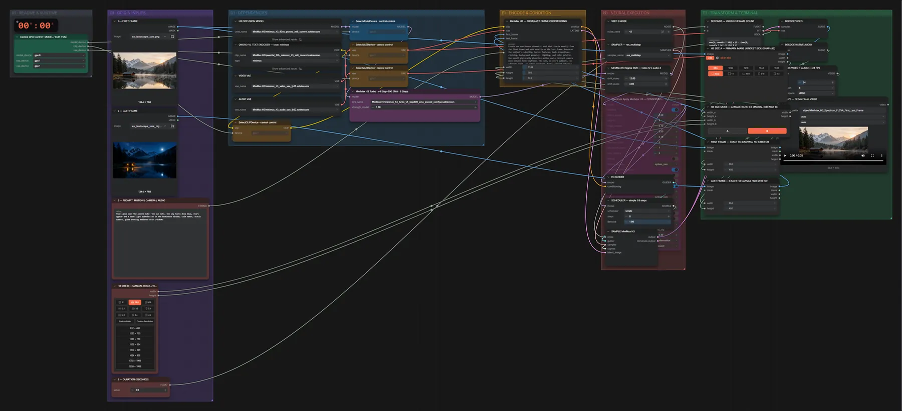

# MiniMax H3 FL2VA (INT8) · erstes + letztes Bild → Video mit Ton

**Workflow-Datei:** [`workflows/Reference to Video/MiniMax_H3_FL2VA_INT8-First+Last-Frame-to-Video.json`](../../../workflows/Reference%20to%20Video/MiniMax_H3_FL2VA_INT8-First%2BLast-Frame-to-Video.json)  
**Kategorie:** Reference to Video · **Eingabe → Ausgabe:** Bild + Text → Video + Audio · **Quant:** INT8

Bis v1.3.0 hieß der Workflow `MiniMax_H3_Spectrum_FL2VA_First_Last_Frame_to_Video_LOCAL.json`.

H3 mit Turbo-LoRA (8 Schritte) füllt den Weg zwischen zwei Bildern und erzeugt passenden Ton.

Interaktiv mit Zoom, Vergleichen und Kopier-Buttons: <https://dawasteh.github.io/DaWastehs-ComfyUI-Bundle/#/w/minimax-h3-fl2va-int8-first-last-frame-to-video>

## Modelle

| Rolle | Datei | Quant | Größe |
|---|---|---|---:|
| Text-Encoder / LLM | `qwen3vl_32b_minimax_h3_int8_convrot.safetensors` | INT8 | 25,3 GiB |
| Diffusionsmodell | `minimax_h3_fl2va_pruned_int8_convrot.safetensors` | INT8 | 19,5 GiB |
| VAE | `minimax_h3_video_vae_fp16.safetensors` | FP16 | 4,8 GiB |
| VAE | `minimax_h3_audio_vae_fp32.safetensors` | FP32 | 0,6 GiB |
| LoRA | `minimax_h3_turbo_v4_step600_ema_pruned_comfyui.safetensors` | BF16 | 0,6 GiB |

## Workflow in ComfyUI

Screenshot nach dem Hauptbeispiel (Eingaben und Ergebnis im Workflow, Erklärungstafeln ausgeblendet):

[](workflow.webp)

## Beispiele

### Erstes + letztes Bild → Video mit Ton

Prompt:

```text
Time-lapse over the alpine lake: the sun sets, the sky turns deep blue, stars appear and a warm light switches on in the boathouse window, calm water, static camera, quiet evening ambience with crickets
```

| Einstellung | Wert |
|---|---|
| duration | 5 s |
| seed | 42 |
| sampler_name | res_multistep |
| scheduler | simple |
| steps | 8 |
| denoise | 1 |
| Dauer (Ausführung) | 3 min 33 s |
| VRAM R9700 (belegt / PyTorch-Spitze) | 23,0 GiB / 21,6 GiB |
| VRAM RX 9070 XT (belegt / PyTorch-Spitze) | 13,1 GiB / 11,9 GiB |
| RAM (ComfyUI-Prozess) | 38,2 GiB |

Eingabe · ex_landscape_lake.png:  ([Datei](input_ex_landscape_lake.webp))  
Eingabe · ex_landscape_lake_night.png:  ([Datei](input_ex_landscape_lake_night.webp))  
Ausgabe · SAVE — FL2VA FINAL VIDEO: [day-night.mp4](day-night.mp4)
