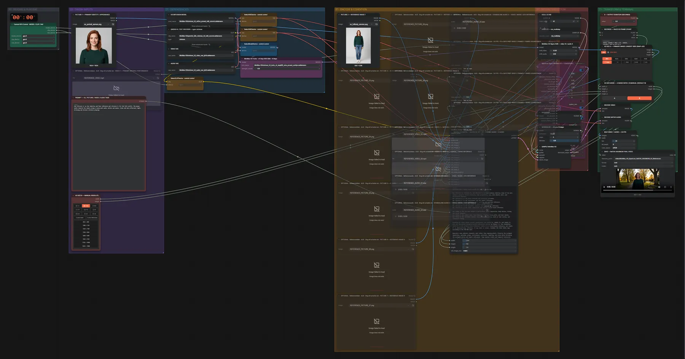

# MiniMax H3 Ref2VA (INT8) · alle Referenzen → Video

**Workflow-Datei:** [`workflows/Reference to Video/MiniMax_H3_Ref2VA_INT8-All-References-to-Video.json`](../../../workflows/Reference%20to%20Video/MiniMax_H3_Ref2VA_INT8-All-References-to-Video.json)  
**Kategorie:** Reference to Video · **Eingabe → Ausgabe:** Bild + Video + Audio + Text → Video + Audio · **Quant:** INT8

Bis v1.3.0 hieß der Workflow `MiniMax_H3_Spectrum_Ref2VA_MAXIMUM_All_Reference_Inputs.json`.

Bis zu 9 Bilder, 3 Videos und 3 Audios als Referenzen (<Picture n>, <Video n>, <Audio n> im Prompt); unbenutzte Eingänge bleiben stumm.

Interaktiv mit Zoom, Vergleichen und Kopier-Buttons: <https://dawasteh.github.io/DaWastehs-ComfyUI-Bundle/#/w/minimax-h3-ref2va-int8-all-references-to-video>

## Modelle

| Rolle | Datei | Quant | Größe |
|---|---|---|---:|
| Text-Encoder / LLM | `qwen3vl_32b_minimax_h3_int8_convrot.safetensors` | INT8 | 25,3 GiB |
| VAE | `minimax_h3_video_vae_fp16.safetensors` | FP16 | 4,8 GiB |
| VAE | `minimax_h3_audio_vae_fp32.safetensors` | FP32 | 0,6 GiB |
| Diffusionsmodell | `minimax_h3_ref2va_pruned_int8_convrot.safetensors` | INT8 | 19,5 GiB |
| LoRA | `minimax_h3_turbo_v4_step600_ema_pruned_comfyui.safetensors` | BF16 | 0,6 GiB |

## Workflow in ComfyUI

Screenshot nach dem Hauptbeispiel (Eingaben und Ergebnis im Workflow, Erklärungstafeln ausgeblendet):

[](workflow.webp)

## Beispiele

### Zwei Referenzbilder → Video mit Ton

Prompt:

```text
Use <Picture 1> as the identity and face reference and <Picture 2> for the full outfit. The woman walks towards the camera along a sunny park path, smiles and waves, trees and warm afternoon light, birdsong and distant children playing.
```

| Einstellung | Wert |
|---|---|
| duration | 5 s |
| seed | 42 |
| sampler_name | res_multistep |
| scheduler | simple |
| steps | 8 |
| denoise | 1 |
| Dauer (Ausführung) | 3 min 48 s |
| VRAM R9700 (belegt / PyTorch-Spitze) | 29,5 GiB / 26,3 GiB |
| RAM (ComfyUI-Prozess) | 34,2 GiB |

Eingabe · ex_portrait_woman.png:  ([Datei](input_ex_portrait_woman.webp))  
Eingabe · ex_fullbody_woman.png:  ([Datei](input_ex_fullbody_woman.webp))  
Ausgabe · SAVE — Ref2VA MAXIMUM FINAL VIDEO: [park.mp4](park.mp4)
