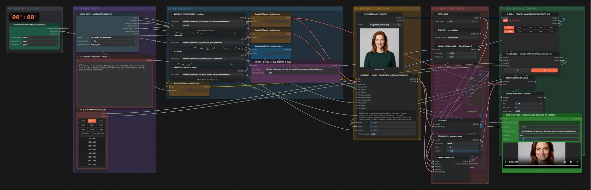

# MiniMax H3 Ref2VA (INT8) · Bild + Audio → sprechendes Video

**Workflow-Datei:** [`workflows/Reference to Video/MiniMax_H3_Ref2VA_INT8-Image+Audio-to-Video.json`](../../../workflows/Reference%20to%20Video/MiniMax_H3_Ref2VA_INT8-Image%2BAudio-to-Video.json)  
**Kategorie:** Reference to Video · **Eingabe → Ausgabe:** Bild + Audio + Text → Video · **Quant:** INT8

Bis v1.3.0 hieß der Workflow `MiniMax_H3_Spectrum_RefImage_Audio_to_Video_OriginalAudio_AutoLength.json`.

Die Person aus dem Bild spricht oder singt die Tonspur; Länge automatisch aus dem Audio, Originalton bleibt erhalten.

Interaktiv mit Zoom, Vergleichen und Kopier-Buttons: <https://dawasteh.github.io/DaWastehs-ComfyUI-Bundle/#/w/minimax-h3-ref2va-int8-image-audio-to-video>

## Modelle

| Rolle | Datei | Quant | Größe |
|---|---|---|---:|
| Text-Encoder / LLM | `qwen3vl_32b_minimax_h3_int8_convrot.safetensors` | INT8 | 25,3 GiB |
| VAE | `minimax_h3_video_vae_fp16.safetensors` | FP16 | 4,8 GiB |
| VAE | `minimax_h3_audio_vae_fp32.safetensors` | FP32 | 0,6 GiB |
| Diffusionsmodell | `minimax_h3_ref2va_pruned_int8_convrot.safetensors` | INT8 | 19,5 GiB |
| LoRA | `minimax_h3_turbo_v4_step600_ema_pruned_comfyui.safetensors` | BF16 | 0,6 GiB |

## Workflow in ComfyUI

Screenshot nach dem Hauptbeispiel (Eingaben und Ergebnis im Workflow, Erklärungstafeln ausgeblendet):

[](workflow.webp)

## Beispiele

### Bild + Sprachaufnahme → sprechendes Video

Prompt:

```text
Use <Picture 1> as the persistent identity, face, hair and clothing. The woman speaks the words of <Audio 1> directly into the camera with natural lip movement and small head nods, plain grey studio, static camera.
```

| Einstellung | Wert |
|---|---|
| duration | Länge der Aufnahme (max. 5 s) |
| seed | 42 |
| sampler_name | res_multistep |
| scheduler | simple |
| steps | 8 |
| denoise | 1 |
| Dauer (Ausführung) | 3 min 27 s |
| VRAM R9700 (belegt / PyTorch-Spitze) | 29,0 GiB / 26,1 GiB |
| RAM (ComfyUI-Prozess) | 35,1 GiB |

Eingabe · ex_portrait_woman.png:  ([Datei](input_ex_portrait_woman.webp))  
Eingabe · ex_speech_de_woman.mp3: [input_ex_speech_de_woman.mp3](input_ex_speech_de_woman.mp3)  
Ausgabe · SAVE FINAL VIDEO + ORIGINAL AUDIO (NO AUDIO RE-ENCODE): [speech.mp4](speech.mp4)
