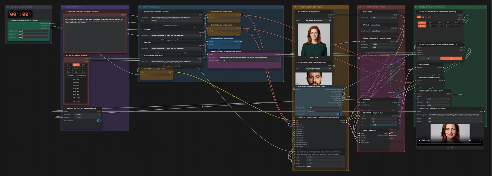

# MiniMax H3 Ref2VA (INT8) · Bild + Video mit Ton → neue Person

**Workflow-Datei:** [`workflows/Reference to Video/MiniMax_H3_Ref2VA_INT8-Image+Video-to-Video-Keep-Sound.json`](../../../workflows/Reference%20to%20Video/MiniMax_H3_Ref2VA_INT8-Image%2BVideo-to-Video-Keep-Sound.json)  
**Kategorie:** Reference to Video · **Eingabe → Ausgabe:** Bild + Video + Text → Video + Audio · **Quant:** INT8

Bis v1.3.0 hieß der Workflow `MiniMax_H3_Spectrum_RefImage_RefVideo_to_Video_Audio_AutoLength.json`.

Performance, Kamera und Ton eines Videos auf die Person aus dem Bild übertragen; Länge wie das Referenzvideo.

Interaktiv mit Zoom, Vergleichen und Kopier-Buttons: <https://dawasteh.github.io/DaWastehs-ComfyUI-Bundle/#/w/minimax-h3-ref2va-int8-image-video-to-video-keep-sound>

## Modelle

| Rolle | Datei | Quant | Größe |
|---|---|---|---:|
| Text-Encoder / LLM | `qwen3vl_32b_minimax_h3_int8_convrot.safetensors` | INT8 | 25,3 GiB |
| VAE | `minimax_h3_video_vae_fp16.safetensors` | FP16 | 4,8 GiB |
| VAE | `minimax_h3_audio_vae_fp32.safetensors` | FP32 | 0,6 GiB |
| Diffusionsmodell | `minimax_h3_ref2va_pruned_int8_convrot.safetensors` | INT8 | 19,5 GiB |
| LoRA | `minimax_h3_turbo_v4_step600_ema_pruned_comfyui.safetensors` | BF16 | 0,6 GiB |

## Workflow in ComfyUI

Screenshot nach dem Hauptbeispiel (Eingaben und Ergebnis im Workflow, Erklärungstafeln ausgeblendet):

[](workflow.webp)

## Beispiele

### Bild + Video mit Ton → neue Person, gleicher Satz

Prompt:

```text
Use <Picture 1> as the identity, face, body, clothing and visual-style reference. Recreate the performance, camera and sound of <Video 1> and <Audio 1> with this woman: she looks into the camera and says the same sentence.
```

| Einstellung | Wert |
|---|---|
| duration | Länge des Referenzvideos (5 s) |
| seed | 42 |
| sampler_name | res_multistep |
| scheduler | simple |
| steps | 8 |
| denoise | 1 |
| Dauer (Ausführung) | 33 min 9 s |
| VRAM R9700 (belegt / PyTorch-Spitze) | 30,6 GiB / 28,3 GiB |
| RAM (ComfyUI-Prozess) | 34,8 GiB |

Eingabe · ex_portrait_woman.png:  ([Datei](input_ex_portrait_woman.webp))  
Eingabe · ex_man_talking.mp4: [input_ex_man_talking.mp4](input_ex_man_talking.mp4)  
Ausgabe · SAVE — EXACT SOURCE-VIDEO LENGTH: [speech-swap.mp4](speech-swap.mp4)
