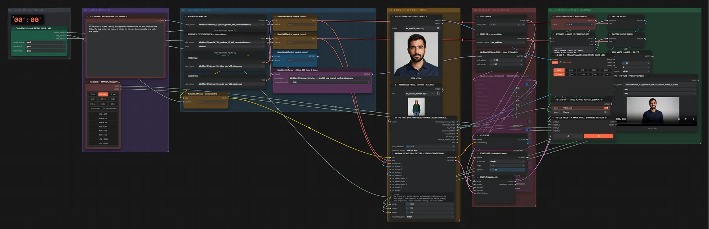

# MiniMax H3 Ref2VA (INT8) · Bild + Video → Video

**Workflow-Datei:** [`workflows/Reference to Video/MiniMax_H3_Ref2VA_INT8-Image+Video-to-Video.json`](../../../workflows/Reference%20to%20Video/MiniMax_H3_Ref2VA_INT8-Image%2BVideo-to-Video.json)  
**Kategorie:** Reference to Video · **Eingabe → Ausgabe:** Bild + Video + Text → Video + Audio · **Quant:** INT8

Bis v1.3.0 hieß der Workflow `MiniMax_H3_Spectrum_Ref2VA_Picture_and_Video_to_Video_LOCAL.json`.

Bild liefert Identität und Aussehen, Video die Bewegung und Kamera.

Interaktiv mit Zoom, Vergleichen und Kopier-Buttons: <https://dawasteh.github.io/DaWastehs-ComfyUI-Bundle/#/w/minimax-h3-ref2va-int8-image-video-to-video>

## Modelle

| Rolle | Datei | Quant | Größe |
|---|---|---|---:|
| Text-Encoder / LLM | `qwen3vl_32b_minimax_h3_int8_convrot.safetensors` | INT8 | 25,3 GiB |
| VAE | `minimax_h3_video_vae_fp16.safetensors` | FP16 | 4,8 GiB |
| VAE | `minimax_h3_audio_vae_fp32.safetensors` | FP32 | 0,6 GiB |
| Diffusionsmodell | `minimax_h3_ref2va_pruned_int8_convrot.safetensors` | INT8 | 19,5 GiB |
| LoRA | `minimax_h3_turbo_v4_step600_ema_pruned_comfyui.safetensors` | BF16 | 0,6 GiB |

## Workflow in ComfyUI

Screenshot nach dem Hauptbeispiel (Eingaben und Ergebnis im Workflow, Erklärungstafeln ausgeblendet):

[](workflow.webp)

## Beispiele

### Bild (Identität) + Video (Bewegung)

Prompt:

```text
Use <Picture 1> as the identity and appearance reference for the main character and follow the body motion and camera of <Video 1>: the man dances casually in a plain grey studio.
```

| Einstellung | Wert |
|---|---|
| duration | 5 s |
| seed | 42 |
| sampler_name | res_multistep |
| scheduler | simple |
| steps | 8 |
| denoise | 1 |
| Dauer (Ausführung) | 7 min 33 s |
| VRAM R9700 (belegt / PyTorch-Spitze) | 30,6 GiB / 27,0 GiB |
| RAM (ComfyUI-Prozess) | 35,7 GiB |

Eingabe · ex_portrait_man.png:  ([Datei](input_ex_portrait_man.webp))  
Eingabe · ex_dance_woman.mp4: [input_ex_dance_woman.mp4](input_ex_dance_woman.mp4)  
Ausgabe · SAVE — PICTURE + VIDEO TO VIDEO: [man-dance.mp4](man-dance.mp4)
