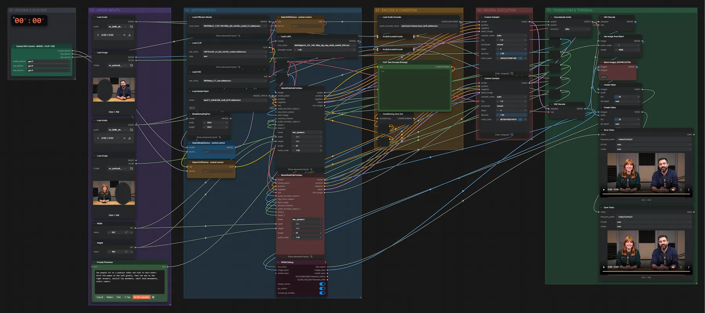
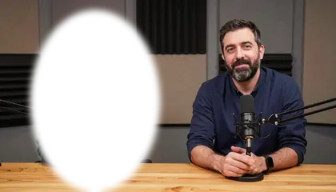
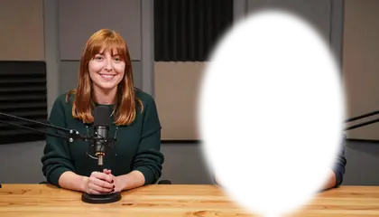

# WAN 2.1 InfiniteTalk 14B (FP8) · Bild + zwei Stimmen → Gespräch

**Workflow-Datei:** [`workflows/Talking Video/WAN21_InfiniteTalk_14B_FP8-Images+Voices-to-Talking-Video.json`](../../../workflows/Talking%20Video/WAN21_InfiniteTalk_14B_FP8-Images%2BVoices-to-Talking-Video.json)  
**Kategorie:** Talking Video · **Eingabe → Ausgabe:** Bild + Maske + Audio → Video · **Quant:** FP8

Bis v1.3.0 hieß der Workflow `WAN21_InfiniteTalk-Multi-Speaker.json`.

Zwei Personen in einem Bild, je eine Maske und eine Stimme: beide sprechen nacheinander lippensynchron.

Interaktiv mit Zoom, Vergleichen und Kopier-Buttons: <https://dawasteh.github.io/DaWastehs-ComfyUI-Bundle/#/w/wan21-infinitetalk-14b-fp8-images-voices-to-talking-video>

## Modelle

| Rolle | Datei | Quant | Größe |
|---|---|---|---:|
| Diffusionsmodell | `Wan2_1-I2V-14B-480p_fp8_e4m3fn_scaled_KJ.safetensors` | FP8 | 15,5 GiB |
| Text-Encoder / LLM | `umt5_xxl_fp8_e4m3fn_scaled.safetensors` | FP8 | 6,3 GiB |
| VAE | `wan_2.1_vae.safetensors` | BF16 | 0,2 GiB |
| LoRA | `lightx2v_I2V_14B_480p_cfg_step_distill_rank64_bf16.safetensors` | BF16 | 0,7 GiB |
| Modell-Patch | `wan2.1_infiniteTalk_multi_fp16.safetensors` | FP16 | 4,8 GiB |
| Audio-Encoder | `wav2vec2-chinese-base_fp16.safetensors` | FP16 | 0,2 GiB |

## Workflow in ComfyUI

Screenshot nach dem Hauptbeispiel (Eingaben und Ergebnis im Workflow, Erklärungstafeln ausgeblendet):

[](workflow.webp)

## Beispiele

### Bild + zwei Stimmen → Gespräch

Prompt:

```text
Two people sit at a podcast table and talk to each other: first the woman on the left greets, then the man on the right answers, natural lip movement, small head movements, static camera
```

| Einstellung | Wert |
|---|---|
| seed | 42 |
| Dauer (Ausführung) | 20 min 19 s |
| VRAM R9700 (belegt / PyTorch-Spitze) | 30,9 GiB / 28,1 GiB |
| RAM (ComfyUI-Prozess) | 30,4 GiB |

Eingabe · Bild + Maske Sprecherin (links):  ([Datei](input_ex_podcast_two_mask_left.webp))  
Eingabe · Maske Sprecher (rechts):  ([Datei](input_ex_podcast_two_mask_right.webp))  
Eingabe · Stimme 1: [input_ex_hello_de_short.mp3](input_ex_hello_de_short.mp3)  
Eingabe · Stimme 2: [input_ex_hello_en_short.mp3](input_ex_hello_en_short.mp3)  
Ausgabe · Video 1: [podcast__n141.mp4](podcast__n141.mp4)  
Ausgabe · Video 2: [podcast__n162.mp4](podcast__n162.mp4)
