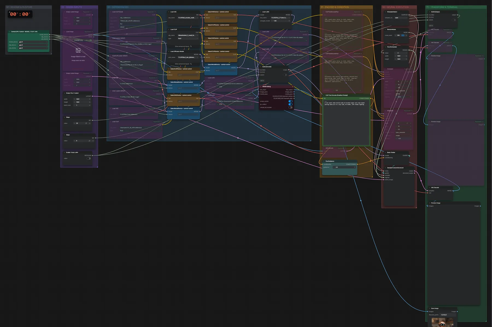

# FLUX.1 vs. FLUX.2 dev · Vergleichsvorlage

**Workflow-Datei:** [`workflows/Templates & Tests/FLUX1_vs_FLUX2_Dev-Text-to-Image-Comparison.json`](../../../workflows/Templates%20%26%20Tests/FLUX1_vs_FLUX2_Dev-Text-to-Image-Comparison.json)  
**Kategorie:** Templates & Tests · **Eingabe → Ausgabe:** Text → Bild

Bis v1.3.0 hieß der Workflow `FLUX1_vs_FLUX2-Model-Comparison.json`.

Vorlage zum Vergleichen: aktiv ist der FLUX.2-dev-Zweig (FP8 mixed, optional Turbo-LoRA), die FLUX.1-Zweige sind überbrückt.

Interaktiv mit Zoom, Vergleichen und Kopier-Buttons: <https://dawasteh.github.io/DaWastehs-ComfyUI-Bundle/#/w/flux1-vs-flux2-dev-text-to-image-comparison>

## Modelle

| Rolle | Datei | Quant | Größe |
|---|---|---|---:|
| VAE | `full_encoder_small_decoder.safetensors` | FP32 | 0,2 GiB |
| Text-Encoder / LLM | `mistral_3_small_flux2_fp8.safetensors` | FP8 | 16,8 GiB |
| LoRA | `Flux_2-Turbo-LoRA_comfyui.safetensors` | BF16 | 2,6 GiB |
| Diffusionsmodell | `flux2_dev_fp8mixed.safetensors` | FP8 mixed | 33,0 GiB |

## Workflow in ComfyUI

Screenshot nach dem Hauptbeispiel (Eingaben und Ergebnis im Workflow, Erklärungstafeln ausgeblendet):

[](workflow.webp)

## Beispiele

### FLUX.2 dev (Standardzweig)

Prompt:

```text
A cute small robot barista made of brushed copper and cream enamel pouring latte art in a cozy café, 3D render, soft studio lighting
```

| Einstellung | Wert |
|---|---|
| seed | 303 |
| guidance | 4 |
| sampler_name | euler |
| Dauer (Ausführung) | 5 min 3 s |
| VRAM R9700 (belegt / PyTorch-Spitze) | 28,3 GiB / 25,1 GiB |
| RAM (ComfyUI-Prozess) | 32,8 GiB |

Ausgabe · Ausgabe: [](robot.webp) · [Volle Auflösung (1024×1024, WebP mit Workflow – per Drag & Drop in ComfyUI ladbar)](robot.webp)
