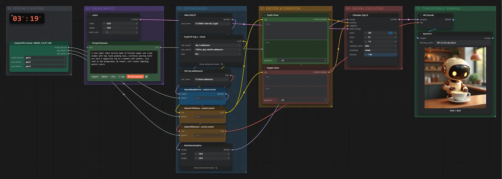
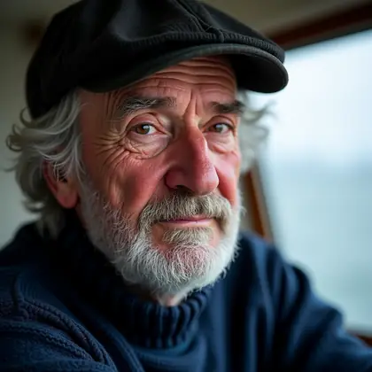
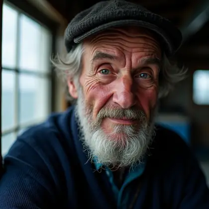
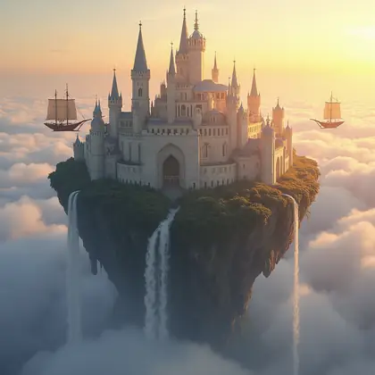
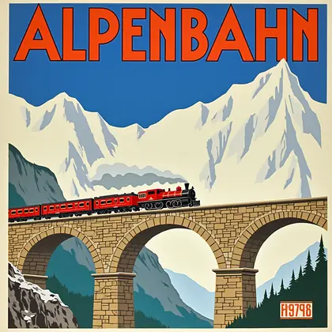
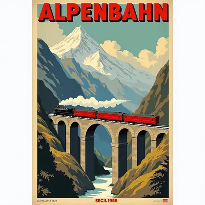
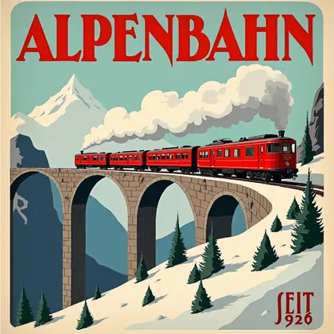

# FLUX.1 dev (GGUF Q6_K) · Text → Bild

**Workflow-Datei:** [`workflows/Text to Image/FLUX1_Dev_Q6_K-Text-to-Image.json`](../../../workflows/Text%20to%20Image/FLUX1_Dev_Q6_K-Text-to-Image.json)  
**Kategorie:** Text to Image · **Eingabe → Ausgabe:** Text → Bild · **Quant:** GGUF Q6_K

Bis v1.3.0 hieß der Workflow `FLUX1_dev_Q6_K-Text-to-Image.json`.

FLUX.1 dev als GGUF Q6_K (~9,8 GB statt 11,9 GB FP8). Gleiche Einstellungen wie die FP8-Version – im Quant-Vergleich direkt nebeneinander.

Interaktiv mit Zoom, Vergleichen und Kopier-Buttons: <https://dawasteh.github.io/DaWastehs-ComfyUI-Bundle/#/w/flux1-dev-q6-k-text-to-image>

## Modelle

| Rolle | Datei | Quant | Größe |
|---|---|---|---:|
| Diffusionsmodell | `flux1-dev-Q6_K.gguf` | Q6_K (GGUF) | 9,2 GiB |
| Text-Encoder | `clip_l.safetensors` | FP16 | 0,2 GiB |
| Text-Encoder | `t5xxl_fp8_e4m3fn.safetensors` | FP8 | 4,6 GiB |
| VAE | `ae.safetensors` | FP32 | 0,3 GiB |

## Workflow in ComfyUI

Screenshot nach dem Hauptbeispiel (Eingaben und Ergebnis im Workflow, Erklärungstafeln ausgeblendet):

[](workflow.webp)

## Beispiele

### 3D-Render · Roboter-Barista · 1536 × 1536

Prompt:

```text
A cute small robot barista made of brushed copper and cream enamel with big round glowing eyes, carefully pouring latte art into a cappuccino cup on a wooden café counter, cozy café in the background, 3D render, soft studio lighting, pastel colors
```

| Einstellung | Wert |
|---|---|
| seed | 303 |
| width | 1536 |
| height | 1536 |
| guidance | 3.5 |
| steps | 25 |
| cfg | 1 |
| sampler_name | euler |
| scheduler | simple |
| denoise | 1 |
| Dauer (Ausführung) | 1 min 27 s |
| VRAM R9700 (belegt / PyTorch-Spitze) | 30,4 GiB / 19,0 GiB |
| RAM (ComfyUI-Prozess) | 15,1 GiB |

Ausgabe · Speichern: [](robot-1536x1536.webp)  

### 3D-Render · Roboter-Barista · 1024 × 1024

Prompt:

```text
A cute small robot barista made of brushed copper and cream enamel with big round glowing eyes, carefully pouring latte art into a cappuccino cup on a wooden café counter, cozy café in the background, 3D render, soft studio lighting, pastel colors
```

| Einstellung | Wert |
|---|---|
| seed | 303 |
| width | 1024 |
| height | 1024 |
| guidance | 3.5 |
| steps | 25 |
| cfg | 1 |
| sampler_name | euler |
| scheduler | simple |
| denoise | 1 |
| Dauer (Ausführung) | 1 min 4 s |
| VRAM R9700 (belegt / PyTorch-Spitze) | 28,6 GiB / 20,9 GiB |
| RAM (ComfyUI-Prozess) | 10,0 GiB |

Ausgabe · Speichern: [](robot-1024x1024.webp) · [Volle Auflösung (1024×1024, WebP mit Workflow – per Drag & Drop in ComfyUI ladbar)](robot-1024x1024.webp)  

### 3D-Render · Roboter-Barista · 768 × 768

Prompt:

```text
A cute small robot barista made of brushed copper and cream enamel with big round glowing eyes, carefully pouring latte art into a cappuccino cup on a wooden café counter, cozy café in the background, 3D render, soft studio lighting, pastel colors
```

| Einstellung | Wert |
|---|---|
| seed | 303 |
| width | 768 |
| height | 768 |
| guidance | 3.5 |
| steps | 25 |
| cfg | 1 |
| sampler_name | euler |
| scheduler | simple |
| denoise | 1 |
| Dauer (Ausführung) | 36 s |
| VRAM R9700 (belegt / PyTorch-Spitze) | 23,2 GiB / 21,4 GiB |
| RAM (ComfyUI-Prozess) | 4,0 GiB |

Ausgabe · Speichern: [](robot-768x768.webp)  

### Porträtfoto · Leuchtturmwärter · 1536 × 1536

Prompt:

```text
Close-up portrait photograph of an elderly lighthouse keeper with a weathered, wrinkled face and a short grey beard, wearing a navy blue knit sweater and a dark wool cap, soft window light from the left, shallow depth of field, 85 mm lens, natural skin texture, calm expression
```

| Einstellung | Wert |
|---|---|
| seed | 101 |
| width | 1536 |
| height | 1536 |
| guidance | 3.5 |
| steps | 25 |
| cfg | 1 |
| sampler_name | euler |
| scheduler | simple |
| denoise | 1 |
| Dauer (Ausführung) | 1 min 26 s |
| VRAM R9700 (belegt / PyTorch-Spitze) | 30,4 GiB / 19,0 GiB |
| RAM (ComfyUI-Prozess) | 15,1 GiB |

Ausgabe · Speichern: [](portrait-1536x1536.webp)  

### Porträtfoto · Leuchtturmwärter · 1024 × 1024

Prompt:

```text
Close-up portrait photograph of an elderly lighthouse keeper with a weathered, wrinkled face and a short grey beard, wearing a navy blue knit sweater and a dark wool cap, soft window light from the left, shallow depth of field, 85 mm lens, natural skin texture, calm expression
```

| Einstellung | Wert |
|---|---|
| seed | 101 |
| width | 1024 |
| height | 1024 |
| guidance | 3.5 |
| steps | 25 |
| cfg | 1 |
| sampler_name | euler |
| scheduler | simple |
| denoise | 1 |
| Dauer (Ausführung) | 46 s |
| VRAM R9700 (belegt / PyTorch-Spitze) | 23,3 GiB / 20,8 GiB |
| RAM (ComfyUI-Prozess) | 4,0 GiB |

Ausgabe · Speichern: [](portrait-1024x1024.webp)  

### Porträtfoto · Leuchtturmwärter · 768 × 768

Prompt:

```text
Close-up portrait photograph of an elderly lighthouse keeper with a weathered, wrinkled face and a short grey beard, wearing a navy blue knit sweater and a dark wool cap, soft window light from the left, shallow depth of field, 85 mm lens, natural skin texture, calm expression
```

| Einstellung | Wert |
|---|---|
| seed | 101 |
| width | 768 |
| height | 768 |
| guidance | 3.5 |
| steps | 25 |
| cfg | 1 |
| sampler_name | euler |
| scheduler | simple |
| denoise | 1 |
| Dauer (Ausführung) | 38 s |
| VRAM R9700 (belegt / PyTorch-Spitze) | 24,6 GiB / 21,3 GiB |
| RAM (ComfyUI-Prozess) | 14,9 GiB |

Ausgabe · Speichern: [](portrait-768x768.webp)  

### Fantasy-Gemälde · Stadt über den Wolken · 1536 × 1536

Prompt:

```text
A floating island city high above the clouds at golden hour, white stone towers and arched bridges, waterfalls pouring off the island edges into the clouds, two wooden airships with canvas sails, warm sunlight, highly detailed fantasy digital painting
```

| Einstellung | Wert |
|---|---|
| seed | 202 |
| width | 1536 |
| height | 1536 |
| guidance | 3.5 |
| steps | 25 |
| cfg | 1 |
| sampler_name | euler |
| scheduler | simple |
| denoise | 1 |
| Dauer (Ausführung) | 1 min 26 s |
| VRAM R9700 (belegt / PyTorch-Spitze) | 30,4 GiB / 19,0 GiB |
| RAM (ComfyUI-Prozess) | 15,1 GiB |

Ausgabe · Speichern: [](fantasy-1536x1536.webp)  

### Fantasy-Gemälde · Stadt über den Wolken · 1024 × 1024

Prompt:

```text
A floating island city high above the clouds at golden hour, white stone towers and arched bridges, waterfalls pouring off the island edges into the clouds, two wooden airships with canvas sails, warm sunlight, highly detailed fantasy digital painting
```

| Einstellung | Wert |
|---|---|
| seed | 202 |
| width | 1024 |
| height | 1024 |
| guidance | 3.5 |
| steps | 25 |
| cfg | 1 |
| sampler_name | euler |
| scheduler | simple |
| denoise | 1 |
| Dauer (Ausführung) | 47 s |
| VRAM R9700 (belegt / PyTorch-Spitze) | 27,9 GiB / 20,8 GiB |
| RAM (ComfyUI-Prozess) | 4,0 GiB |

Ausgabe · Speichern: [](fantasy-1024x1024.webp)  

### Fantasy-Gemälde · Stadt über den Wolken · 768 × 768

Prompt:

```text
A floating island city high above the clouds at golden hour, white stone towers and arched bridges, waterfalls pouring off the island edges into the clouds, two wooden airships with canvas sails, warm sunlight, highly detailed fantasy digital painting
```

| Einstellung | Wert |
|---|---|
| seed | 202 |
| width | 768 |
| height | 768 |
| guidance | 3.5 |
| steps | 25 |
| cfg | 1 |
| sampler_name | euler |
| scheduler | simple |
| denoise | 1 |
| Dauer (Ausführung) | 38 s |
| VRAM R9700 (belegt / PyTorch-Spitze) | 24,6 GiB / 21,3 GiB |
| RAM (ComfyUI-Prozess) | 14,9 GiB |

Ausgabe · Speichern: [](fantasy-768x768.webp)  

### Schrift · Reiseplakat „ALPENBAHN“ · 1536 × 1536

Prompt:

```text
Vintage 1920s travel poster for a mountain railway, bold art deco lettering at the top that reads "ALPENBAHN" and smaller text at the bottom that reads "SEIT 1926", a red steam train crossing a stone viaduct, snowy alpine peaks, flat colors, lithograph print texture
```

| Einstellung | Wert |
|---|---|
| seed | 404 |
| width | 1536 |
| height | 1536 |
| guidance | 3.5 |
| steps | 25 |
| cfg | 1 |
| sampler_name | euler |
| scheduler | simple |
| denoise | 1 |
| Dauer (Ausführung) | 1 min 27 s |
| VRAM R9700 (belegt / PyTorch-Spitze) | 30,4 GiB / 19,0 GiB |
| RAM (ComfyUI-Prozess) | 15,1 GiB |

Ausgabe · Speichern: [](poster-1536x1536.webp)  

### Schrift · Reiseplakat „ALPENBAHN“ · 1024 × 1024

Prompt:

```text
Vintage 1920s travel poster for a mountain railway, bold art deco lettering at the top that reads "ALPENBAHN" and smaller text at the bottom that reads "SEIT 1926", a red steam train crossing a stone viaduct, snowy alpine peaks, flat colors, lithograph print texture
```

| Einstellung | Wert |
|---|---|
| seed | 404 |
| width | 1024 |
| height | 1024 |
| guidance | 3.5 |
| steps | 25 |
| cfg | 1 |
| sampler_name | euler |
| scheduler | simple |
| denoise | 1 |
| Dauer (Ausführung) | 47 s |
| VRAM R9700 (belegt / PyTorch-Spitze) | 27,9 GiB / 20,8 GiB |
| RAM (ComfyUI-Prozess) | 4,0 GiB |

Ausgabe · Speichern: [](poster-1024x1024.webp)  

### Schrift · Reiseplakat „ALPENBAHN“ · 768 × 768

Prompt:

```text
Vintage 1920s travel poster for a mountain railway, bold art deco lettering at the top that reads "ALPENBAHN" and smaller text at the bottom that reads "SEIT 1926", a red steam train crossing a stone viaduct, snowy alpine peaks, flat colors, lithograph print texture
```

| Einstellung | Wert |
|---|---|
| seed | 404 |
| width | 768 |
| height | 768 |
| guidance | 3.5 |
| steps | 25 |
| cfg | 1 |
| sampler_name | euler |
| scheduler | simple |
| denoise | 1 |
| Dauer (Ausführung) | 38 s |
| VRAM R9700 (belegt / PyTorch-Spitze) | 23,1 GiB / 21,3 GiB |
| RAM (ComfyUI-Prozess) | 14,9 GiB |

Ausgabe · Speichern: [](poster-768x768.webp)
