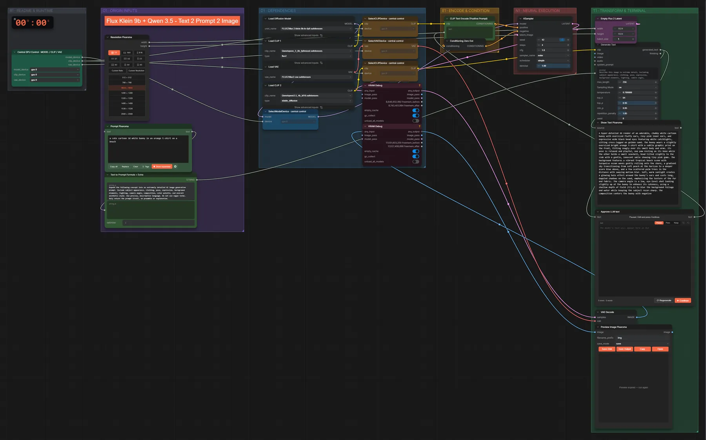
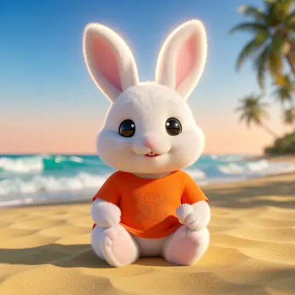

# FLUX.2 Klein 9B + Qwen3.5 · Idee → Prompt → Bild

**Workflow-Datei:** [`workflows/Text to Image/FLUX2_Klein_9B_KV_FP8+Qwen3_5_4B-Idea-to-Prompt-to-Image.json`](../../../workflows/Text%20to%20Image/FLUX2_Klein_9B_KV_FP8%2BQwen3_5_4B-Idea-to-Prompt-to-Image.json)  
**Kategorie:** Text to Image · **Eingabe → Ausgabe:** Text → Prompt + Bild · **Quant:** FP8

Bis v1.3.0 hieß der Workflow `FLUX2_Klein_9B_Qwen3_5-Text-to-Prompt-to-Image.json`.

Qwen3.5 4B schreibt aus einer kurzen Idee einen ausführlichen Prompt, du bestätigst ihn am Pause-Knoten, dann malt FLUX.2 Klein 9B (FP8) das Bild.

Interaktiv mit Zoom, Vergleichen und Kopier-Buttons: <https://dawasteh.github.io/DaWastehs-ComfyUI-Bundle/#/w/flux2-klein-9b-kv-fp8-qwen3-5-4b-idea-to-prompt-to-image>

## Modelle

| Rolle | Datei | Quant | Größe |
|---|---|---|---:|
| Diffusionsmodell | `flux-2-klein-9b-kv-fp8.safetensors` | FP8 | 9,1 GiB |
| Text-Encoder / LLM | `qwen_3_8b_fp8mixed.safetensors` | FP8 mixed | 8,1 GiB |
| VAE | `flux2-vae.safetensors` | FP32 | 0,3 GiB |
| Text-Encoder / LLM | `qwen3.5_4b_bf16.safetensors` | BF16 | 8,7 GiB |

## Workflow in ComfyUI

Screenshot nach dem Hauptbeispiel (Eingaben und Ergebnis im Workflow, Erklärungstafeln ausgeblendet):

[](workflow.webp)

## Beispiele

### Idee → Prompt (Pause) → Bild

Prompt:

```text
a cute cartoon 3d white bunny in an orange t-shirt on a beach
```

| Einstellung | Wert |
|---|---|
| seed | 42 |
| steps | 4 |
| cfg | 1 |
| sampler_name | euler |
| scheduler | simple |
| denoise | 1 |
| Dauer (Ausführung) | 43 s |
| VRAM R9700 (belegt / PyTorch-Spitze) | 27,0 GiB / 23,1 GiB |
| RAM (ComfyUI-Prozess) | 14,3 GiB |

Der Prompt von Qwen3.5 wird am Pause-Knoten unverändert übernommen („Continue“).

Ausgabe · Ausgabe: [](bunny.webp) · [Volle Auflösung (1024×1024, WebP mit Workflow – per Drag & Drop in ComfyUI ladbar)](bunny.webp)  

PixaromaShowText:

```text
A hyper-detailed 3D render of an adorable, chubby white cartoon bunny with oversized fluffy ears, rosy pink inner ears, and expressive wide black bead eyes featuring white catchlights, sitting cross-legged on golden sand. The bunny wears a slightly oversized bright orange t-shirt with a subtle graphic print on the front, fitting snugly over its small body and arms. Its pose is relaxed and playful, one paw resting on its knee while the other holds a small seashell, head tilted slightly to the side with a gentle, innocent smile showing tiny pink gums. The background features a vibrant tropical beach scene with turquoise ocean waves gently rolling onto the shore, a gradient sky transitioning from soft peach at the horizon to a deeper azure blue above, and a few scattered palm trees in the distance with swaying motion blur. Soft, warm sunlight creates a glowing halo effect around the bunny's ears and casts long, dappled shadows on the sand, emphasizing the texture of the fur and fabric. The camera angle is a low, eye-level shot looking slightly up at the bunny to enhance its cuteness, using a shallow depth of field (f/1.8) to blur the background foliage and water while keeping the subject razor-sharp. The composition centers the bunny with negative
```
